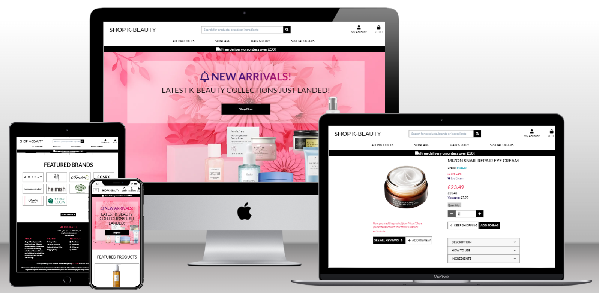
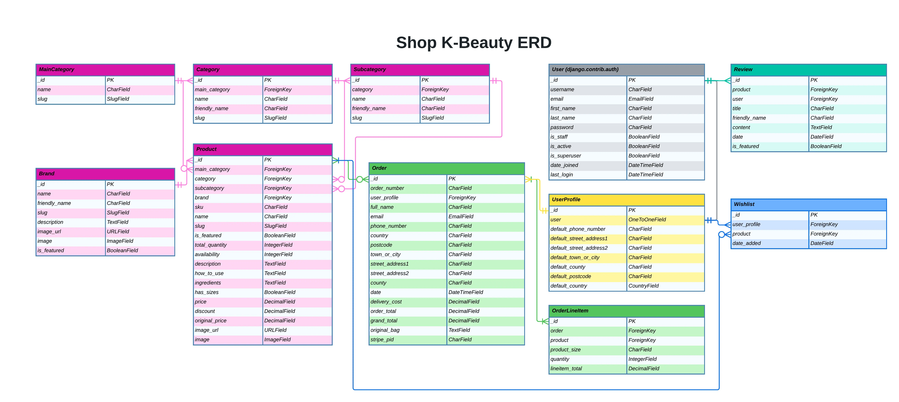
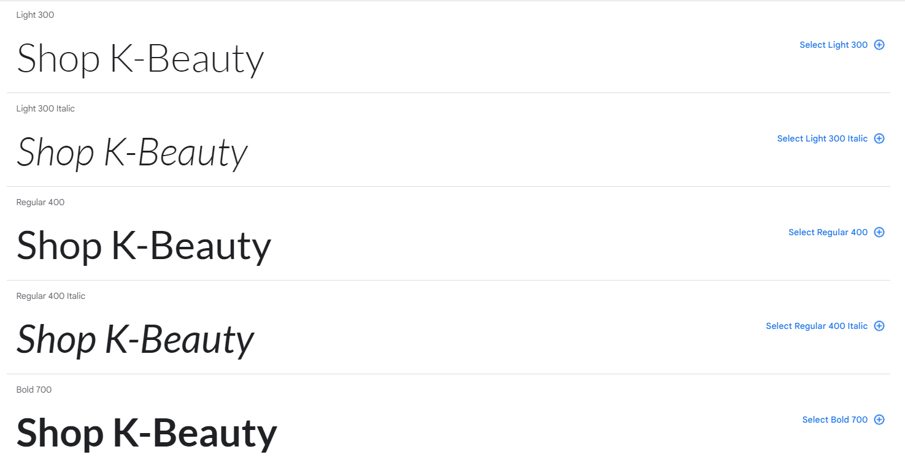
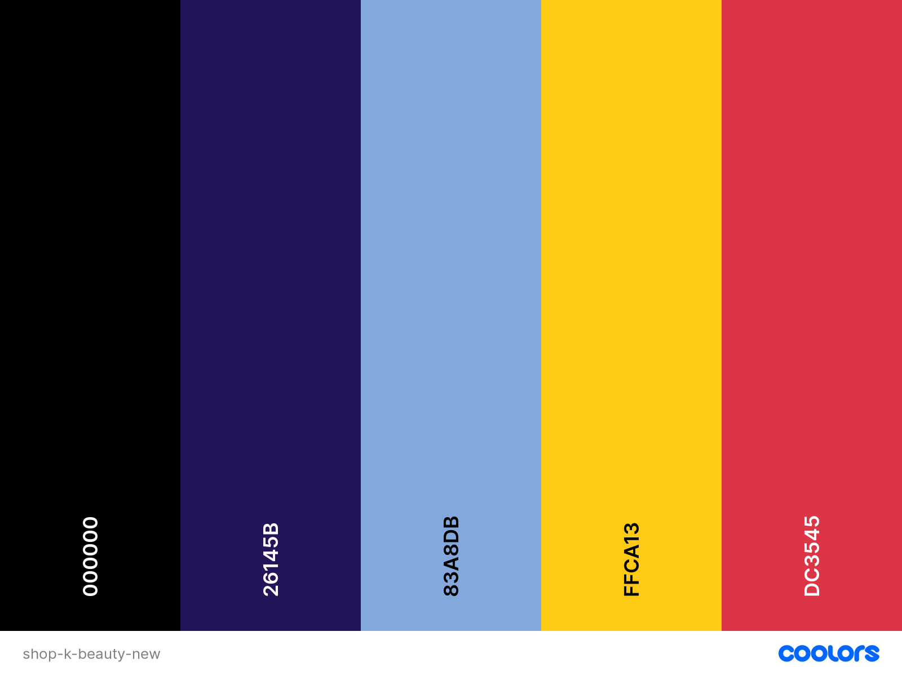
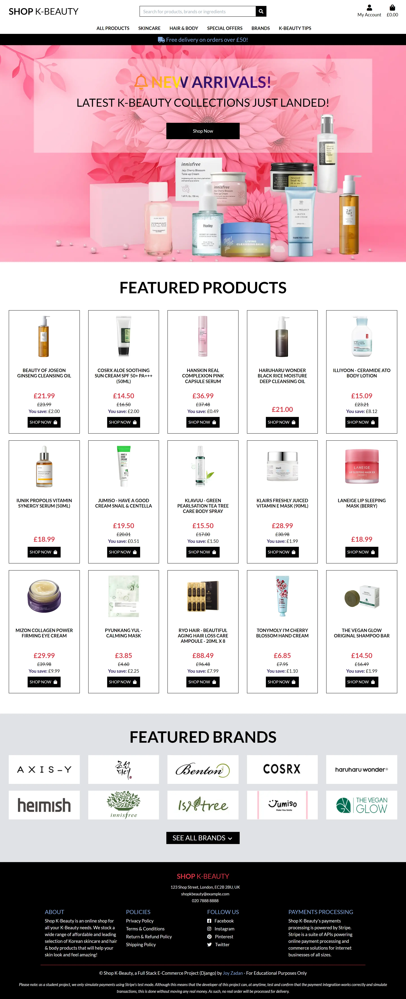

# **SHOP K-BEAUTY**

**[Link to the Deployed App](https://shop-k-beauty-django-joy-zadan.herokuapp.com/)**

# Project Overview

Shop K-Beauty is a multi-brand, ecommerce full stack project built using Django, Python and JavaScript, deployed to Heroku, uses Amazon S3 for cloud storage and Stripe for payment processing. Shop K-Beauty is a business to consumer online retailer of K-Beauty skincare and hair &amp; body products.

Shop K-Beauty is my fourth milestone project for Code Institute's Level 5 Diploma in Web Application Development (Full Stack Software Development).
 
 

TABLE OF CONTENTS - Click to Expand

* [USER EXPERIENCE](#user-experience)
    * [Strategy Plane](#strategy-plane)
        * [Project Goals](#project-goals)
            * [Stakeholders' Goals](#stakeholders-goals)
                * [Business Model](#business-model)
            * [Product Goals](#product-goals)
            * [User Research](#user-research)
                * [Discovery Phase](#discovery-phase)
                * [Design Phase](#design-phase)
                * [Product Launch - Alpha](#product-launch---alpha)
                * [Product Launch - Beta](#product-launch---beta)
    * [Scope Plane](#scope-plane)
        * [Feature Planning](#feature-planning)
        * [Content Requirement Planning](#content-requirement-planning)
        * [Functionalities for User Interaction](#functionalities-for-user-interaction)
            * [User Stories](#user-stories)
    * [Structure Plane](#structure-plane)
        * [Interaction Design](#interaction-design)
            * [User Journey Flow Chart](#user-journey-flow-chart)
        * [Information Architecture](#information-architecture)
            * [Site Map](#site-map)
        * [Website Pages](#website-pages)
        * [Database Design](#database-design)
            * [Database ERD](#database-erd)
            * [Data Modelling](#data-modelling)
                * [User Model](#user-model)
                * [UserProfile](#userprofile-model)
                * [MainCategory Model](#maincategory-model)
                * [Category Model](#category-model)
                * [Subcategory Model](#subcategory-model)
                * [Brand Model](#brand-model)
                * [Product Model](#product-model)
                * [Order Model](#order-model)
                * [OrderLineItem Model](#orderlineitem-model)
                * [Review Model](#review-model)
                * [Wishlist Model](#wishlist-model)
    * [Skeleton Plane](#skeleton-plane)
        * [Wireframes](#wireframes)
    * [Surface Plane](#surface-plane)
        * [Typography](#typography)
        * [Colour Palette](#colour-palette)
* [Agile Methodology](#agile-methodology)
    * [GitHub Project Management](#github-project-management)
* [Features](#features)
    * [General Features of the Site](#general-features-of-the-site)
    * [Must Have Features of an Ecommerce Site](#must-have-features-of-an-ecommerce-site)
    * [Accessibility](#accessibility)
    * [Future Development, Iteration and Implementation](#future-development-iteration-and-implementation)
* [Technologies Used](#technologies-used)
    * [Languages Used](#languages-used)
    * [Frameworks Used](#frameworks-used)
    * [Databases Used](#databases-used)
    * [Libraries and Packages Used](#libraries-and-packages-used)
    * [Programmes and Applications Used](#programmes-and-applications-used)
    * [Payment Processing Platform Used](#payment-processing-platform-used)
    * [Cloud Application Platforms Used](#cloud-platforms-used)
    * [Cloud Storage Services Used](#cloud-storage-services-used)
* [Testing](#testing)
* [Bugs, Issues and Solutions](#bugs-issues-and-solutions)
* [Deployment and Local Development](#deployment-and-local-development)
    * [Deployment](#deployment)
    * [Local Development](#local-development)
        * [How to Fork](#how-to-fork)
        * [How to Clone](#how-to-clone)
* [Credits](#credits)
* [Acknowledgements](#acknowledgements)

---

## USER EXPERIENCE

### STRATEGY

Straits Research, in its [K-Beauty Products Market Report](https://straitsresearch.com/report/k-beauty-products-market) stated that **"the global K-Beauty products market size had a revenue holding of US$8.30 billion in 2021. It is expected to reach US$18.32 billion by 2030, growing at a CAGR (compound annual growth rate) of 9.2% during the forecast period (2022-2030). Skincare items originating in South Korea are collectively referred to as K-Beauty."**

#### Project Goals
This section aims to answer the key question: *What problems are we trying to solve with Shop K-Beauty?*

Although the demand for cosmetics products declined globally during the pandemic due mainly to fewer occasions to wear make-up given the guidelines on working from home, social distancing and wearing masks, there was also a corresponding rise in consumption focused on skincare products driven by increasing demand for affordable, fast-acting, self-care beauty routines.

Shop K-Beauty, a multi-brand ecommerce store specialising in K-Beauty skincare and hair &amp; body products, aims to provide an easy to use online shop for consumers to browse and purchase K-Beauty products. Shop K-Beauty also aims to provide the information that consumers may require such as a product description, how to use a product and the product ingredients.

Update:
1. Brand
2. Reviews
3. Wishlist
In addition, Shop K-Beauty aims to include a reviews functionality for anynomous shoppers to view available product reviews and logged in users to add their own product reviews.

##### Internal Stakeholders'
Ultimately, the internal stakeholders' goals would be to have a profitable and positively-perceived online shop specialising in K-Beauty products.

To achieve the above, internal stakeholders would need to be able to make informed decisions by having a clear set of metrics and KPIs (key performance indicators) they should be able to access and review on a regular basis.

###### Business Model

##### Product

##### User Research
###### Discovery Phase
###### Design Phase
###### Product Launch - Alpha
###### Product Launch - Beta

### SCOPE PLANE
#### Feature Planning
When planning the Shop K-Beauty ecommerce store's features and scope, I drew up an Importance Viability analysis of these features, please see below:

| # | Feature | Importance | Viability | User Impact Score | Release Notes |
| --- | --- | --- | --- | --- | --- |
| 1 | ... |  |  |  |  |
| 2 | ... |  |  |  |  |

#### Content Requirement Planning
#### Functionalities for User Interaction
##### User Stories
| **USER STORY #** | **ISSUE ID** | **As a/an** | **I want to be able to...** | **So that I can...** |
| --- | --- | --- | --- | --- |
| **VIEWING & NAVIGATION** |   |   |
| 1 | [#9](https://github.com/JoyZadan/shop-kbeauty/issues/9) | Shopper | Navigate around the site | View a list of products  |
| 2 | [#54](https://github.com/JoyZadan/shop-kbeauty/issues/54) | Shopper | View a specific category of products | Quickly find products I'm interested in without having to search through all products. |
| 3 | [#47](https://github.com/JoyZadan/shop-kbeauty/issues/47) | Shopper | Quickly identify deals, clearance items and special offers | Take advantage of special savings on products I'd like to purchase |
| 4 | [#32](https://github.com/JoyZadan/shop-kbeauty/issues/32) | Shopper | Quickly view how much was the original price | Identify how much I may be able to save when buying the product and may also help me compare prices with other sites |
| 5 | [#36](https://github.com/JoyZadan/shop-kbeauty/issues/36) | Shopper | View individual product details | Identify the price, description, product reviews, product image, product ingredients and and instructions how to use product |
| 6 | [#38](https://github.com/JoyZadan/shop-kbeauty/issues/38) | Shopper | Easily view the total of my purchases in the bag at any time | Avoid spending too much |
| 7 | [#28](https://github.com/JoyZadan/shop-kbeauty/issues/28) | Shopper | Easily view the featured brands | To assure me that Shop K-Beauty really offers K-Beauty products from authentic K-Beauty brands |
| 8 | [#48](https://github.com/JoyZadan/shop-kbeauty/issues/48) | Shopper | Search/ View all of the available K-Beauty brands | Look for my favourite brands  |
| 9 | [#70](https://github.com/JoyZadan/shop-kbeauty/issues/70) | Shopper | Easily view details about the brand of a product I am purchasing | Learn more about the brands and feel confident about my purchase |
| 10 | [#73](https://github.com/JoyZadan/shop-kbeauty/issues/73) | Shopper | View a list of available products when viewing the details about a brand | Quickly decide what product to purchase from a particular brand |
| 11 | [#81](https://github.com/JoyZadan/shop-kbeauty/issues/81) | Shopper | Find skincare tips and information about K-Beauty skincare routine | Decide which products I need to purchase |
| 12 | [#82](https://github.com/JoyZadan/shop-kbeauty/issues/82) | Shopper | Easily navigate from a product category to the corresponding subcategories | Easily find the products I am looking for |
| **REGISTRATION & USER ACCOUNTS** |   |   |
| 13 | [#8](https://github.com/JoyZadan/shop-kbeauty/issues/8)| Site User | Easily register for an account | Have a personal account and be able to view my profile |
| 14 | [#52](https://github.com/JoyZadan/shop-kbeauty/issues/52) | Shopper | Receive an email confirmation after registering | View that my personal account registration was successful |
| 15 | [#50](https://github.com/JoyZadan/shop-kbeauty/issues/50) | Shopper | Easily login and logout of my shopper's account | Access my personal account information |
| 16 | [#51](https://github.com/JoyZadan/shop-kbeauty/issues/51) | Shopper | Easily recover my password in case I forget it | Recover access to my account |
| 17 | [#53](https://github.com/JoyZadan/shop-kbeauty/issues/53) | Shopper | Have a personalised user profile | View my personal order history and order confirmations |
| **SORTING & SEARCHING** |   |   |
| 18 | [#31](https://github.com/JoyZadan/shop-kbeauty/issues/31) | Shopper | Sort the list of available products | Easily identiify the best rated, best priced and categorically sorted products |
| 19 | [#54](https://github.com/JoyZadan/shop-kbeauty/issues/54) | Shopper | Sort a specific category of product | Find the best priced or best rated product in a specific category, or sort the products in that categpry by name |
| 20 | [#55](https://github.com/JoyZadan/shop-kbeauty/issues/55) | Shopper | Sort a specific subcategories of products | To easily identify the most suitable product for me to purchase  |
| 21 | [#56](https://github.com/JoyZadan/shop-kbeauty/issues/56) | Shopper | Sort multiple categories of products simultaneously | Find the best priced, special offers or best rated /reviewed products across broad categories, such as "makeup" or "skincare"  |
| 22 | [#29](https://github.com/JoyZadan/shop-kbeauty/issues/29) | Shopper | Search for a product or products by name, by description or by ingredients | Find a specific product I'd like to purchase  |
| 23 | [#57](https://github.com/JoyZadan/shop-kbeauty/issues/57) | Shopper | Easily see what I've searched for and the number of results | Quickly decide whether the product I want is available |
| **PURCHASING & CHECKOUT** |   |   |
| 24 | [#32](https://github.com/JoyZadan/shop-kbeauty/issues/32) | Shopper | Quickly view how much was the original price and what savings, if any are available | Easily compare prices with other sites |
| 25 | [#39](https://github.com/JoyZadan/shop-kbeauty/issues/39) | Shopper | Easily select the size and quantity for a product when purchasing it |Ensure I don't accidentally select the wrong product, quantity or size |
| 26 | [#33](https://github.com/JoyZadan/shop-kbeauty/issues/33) | Shopper | Easily view notifications on screen when I add a product to my bag | Find out immediately if my actions were correct or if the was an error |
| 27 | [#40](https://github.com/JoyZadan/shop-kbeauty/issues/40) | Shopper | View items in my bag to be purchased | Identify the total cost of my purchase and all items I will receive |
| 28 | [#41](https://github.com/JoyZadan/shop-kbeauty/issues/41) | Shopper | Adjust the quantity of individual items in my bag | Easily make changes to my purchase before checkout |
| 29 | [#42](https://github.com/JoyZadan/shop-kbeauty/issues/42) | Shopper | Easily enter my payment information | Check out quickly and with no hassles |
| 30 | [#43](https://github.com/JoyZadan/shop-kbeauty/issues/43) | Shopper | Feel my personal and payment information is safe and secure | Confidently provide the needed information to make a purchase |
| 31 | [#44](https://github.com/JoyZadan/shop-kbeauty/issues/44) | Shopper |View an order confirmation after checkout | Verify that I haven't made any mistakes |
| 32 | [#45](https://github.com/JoyZadan/shop-kbeauty/issues/45) | Shopper | Receive an email confirmation after checking out | Keep the confirmation of what I've purchased for my records |
| **PRODUCT REVIEWS** |   |   |
| 33 | [#64](https://github.com/JoyZadan/shop-kbeauty/issues/64) | Shopper | View available reviews for a product I am viewing  | Find out what others think of the product |
| 34 | [#58](https://github.com/JoyZadan/shop-kbeauty/issues/58) | Shopper | Easily see how I can add my reviews on products I purchased | Decide whether I want to add my review |
| 35| [#71](https://github.com/JoyZadan/shop-kbeauty/issues/71) | Shopper | Easily view/ have access to details about the product I am reviewing | Refer to the information about the product, should I need to do so |
| 36 | [#65](https://github.com/JoyZadan/shop-kbeauty/issues/65) | Shopper | Add my review of the product | Share my personal experienceof using the products  |
| 37 | [#23](https://github.com/JoyZadan/shop-kbeauty/issues/23) | Store Owner | Add Featured Reviews on specific product detail page | Opt to highlight specific reviews |
| 38 | [#66](https://github.com/JoyZadan/shop-kbeauty/issues/66) | Store Owner | Edit submitted reviews | Opt to block off profanities, if any |
| 39 | [#67](https://github.com/JoyZadan/shop-kbeauty/issues/67) | Store Owner | Delete a review | Have control over unacceptable comments such as discriminatory statements, if any |
| **ADMIN & STORE MANAGEMENT** |   |   |
| 40 | [#60](https://github.com/JoyZadan/shop-kbeauty/issues/60) | Store Owner | Add a product | Add new items to my store |
| 41 | [#61](https://github.com/JoyZadan/shop-kbeauty/issues/61) | Store Owner | Edit/update a product | Change product proces, descriptions, ingredients, images and other product criteria |
| 42 | [#62](https://github.com/JoyZadan/shop-kbeauty/issues/62) | Store Owner | Delete a product | Remove items that are no longer for sale |
| 43 | [#72](https://github.com/JoyZadan/shop-kbeauty/issues/72) | Store Owner | Use/ have policy pages (privacy, terms & conditions, return & refund and shipping) | Be assured that all the legalities of doing business online are taken care of |
| 44 | [#76](https://github.com/JoyZadan/shop-kbeauty/issues/76) | Store Owner | Receive a warning if I accidentally click the delete a product button | Avoid accidental deletion of a product |
| 45 | [#83](https://github.com/JoyZadan/shop-kbeauty/issues/83) | Store Owner | Add a brand to my store | Add new products even if the product's brand is not in the store yet |
| 46 | [#84](https://github.com/JoyZadan/shop-kbeauty/issues/84) | Store Owner | Edit/ Update a brand in my store | Make changes to a brand name, description, brand logo or choose to feature a brand |
| **DIGITAL MARKETING** |   |   |
| 47 | [#26](https://github.com/JoyZadan/shop-kbeauty/issues/26) | Store Owner | Have a social media presence | Create awareness of Shop K-Beauty products |
| **USER'S WISHLIST** |   |   |
| 48 | [#85](https://github.com/JoyZadan/shop-kbeauty/issues/85) | Shopper | Easily add a product to my wishlist | Save it for future purchase or reference |
| 49 | [#87](https://github.com/JoyZadan/shop-kbeauty/issues/87) | Shopper | Easily remove a product from my wishlist | Keep pnly the products I'm interested in |
| **FOR FUTURE IMPLEMENTATION** |   |   |
| 50| # | Shopper | register an account via social account | easy registration |
| 51 | # | Shopper | login via social account | avoid having to keep track of login details |
| 52 | # | Shop Owner | stock inventory app | keep track of current total quantity less products sold and update current availability |

### STRUCTURE PLANE
#### Interaction Design
##### User Journey Flow Chart
#### Information Architecture
##### Site Map
#### Website Pages
#### Database Design
##### Database ERD
**Entity Relationship Diagram** 
Version 1: [ERD/DATABASE SCHEMA - V1](./documentation/database/shop-kbeauty-erd-v1.png) 
Version 2 - FINAL: 

 

##### Data Modelling
###### User Model
###### UserProfile Model
###### MainCategory Model
###### Category Model
###### Subcategory Model
###### Brand Model
###### Product Model
###### Order Model
###### OrderLineItem Model
###### Review Model
###### Wishlist Model

### SKELETON PLANE
#### Wireframes

### SURFACE PLANE
#### Typography
I decided to use only one font, **Lato**, for this project and used different font-weights and italics to add contrast to text. The decision to stick to one font is based how ecommerce shops tend to look very busy with photos of products, call-to-action buttons, pricing and discount buttons, etc. For the hero section on the index.html and skincare_tips.html pages, I added an animation to the text using linear-gradient based on the site's colour scheme.
  

#### Colour Palette
The site is mainly black and white and uses accent colours to liven it up. I have taken inspiration from the hero image colours, pink and yellow, and also added midnight blue and light blue colours to add contrast.

Following the Lighthouse and a11y validation results, I amended the colour scheme from **[this](./documentation/branding/palette-old.png)** to this:
  

#### Imagery

#### Mockups
---
## AGILE METHODOLOGY
### GitHub Project Management

---
## FEATURES
### General Features of the Site
Common to all pages of the Shop K-Beauty site are:
* Navbar:
    * Top Navigation:
        * logo
        * search bar
        * my account (login, register)
            * for logged in superadmin:
                * brand management
                * product management
                * my profile
                * logout
            * for logged in user:
                * my profile
                * logout
        * wishlist (for logged in user)
        * bag
    * Main Navigation
* Footer:
        * Shop K-Beauty fictitious address, email and phone number
        * About - brief blurb about the shop
        * Policies
        * Social Media Links
        * Payment Processing Statement
        * Copyright and Disclaimer

#### Product Categorization
**"Accurate product categorization improves the customer experience and also helps merchants reach the right shoppers."** - [Feedonomics](https://feedonomics.com/blog/product-categorization-101-why-it-matters/)
* Main Categories
* Categories
* Subcategories

#### Site Pages
##### Home Page
Shop K-Beauty's home page features the following:
* "Above the fold":
    * A background hero image showcasing some of the globally renowned K-Beauty brands.
    * An attending getting Call to Action text announcing the arrival of the latest collections and a "shop now" button
* "Below the fold":
    * Featured Products
    * Featured Brands
    * See All Brands Button

**Home page Screenshot**
 
 

#### Defensive Programming

## Shop K-Beauty and Must Have Features of an Ecommerce Site
## Accessibility
## Future Development, Iteration and Implementation

---
# TECHNOLOGIES USED
## Languages Used
* [HTML5](https://en.wikipedia.org/wiki/HTML5) was used for the content and structure of the site.
* [CSS3](https://en.wikipedia.org/wiki/CSS#CSS_3) was used for the styling of the site.
* [JavaScript](https://en.wikipedia.org/wiki/JavaScript) was used for the interactivity of the site.
* [Python](https://www.python.org/) was used for the back end programming of the site.
## Frameworks Used
* [DJANGO - v3.2 ](https://docs.djangoproject.com/en/4.1/releases/3.2/) Django is a free and open-source, Python-based web  framework that follows the model–template–views architectural pattern.
* [Bootstrap4 - v4.6](https://getbootstrap.com/docs/4.6/getting-started/introduction/) was used as the frontend framework.
## Databases Used
* [DB.SQLITE3](https://docs.djangoproject.com/en/4.1/ref/databases/#sqlite-notes) was the database used for the project (development).
* [ElephantSQL](https://www.elephantsql.com/) ElephantSQL's Postgres as a Service was used to host the the database for the project (production).

## Libraries and Packages Used
* [django-allauth](https://django-allauth.readthedocs.io/en/latest/) is an integrated set of Django applications dealing with account authentication, registration, management, and third-party (social) account authentication
* [JQuery - v3.5.1](https://jquery.com/) is a fast, small, and feature-rich JavaScript library.
* [Font Awesome Kit](https://fontawesome.com/v5/docs/web/setup/use-kit) is used for its icon toolkit
* 
## Programmes and Applications Used

## Payment Processing Platform Used
## Cloud Application Platforms Used
## Cloud Storage Services Used
* [AWS S3](https://aws.amazon.com/) was used to store upload images and static files
---

# TESTING
Please refer to [TESTING.md](./TESTING.md) file for:
* Automated Testing and Validation Results
* Manual Testing and Results

 

---
# BUGS, ISSUES AND SOLUTIONS
Please also refer to [TESTING.md](./TESTING.md) file for:
* Solutions to bugs found during testing and development phase
* Known bugs
 

---
# DEPLOYMENT
Please refer to [DEPLOYMENT.md](./DEPLOYMENT.md) file for:
* Creating the database to be used in production
* Deploying to Heroku
* Setting up AmazonS3 for hosting our static and media files
* Instructions to common question: *"What if you didn't use fixtures in your project?"*

(DRAFT BELOW):
* Heroku Setup and CLI
* Installing Project Requirements
* Creating a Heroku App
* Creating a database to be used in production
* Connecting the database to our application
* Connecting the database to GitPod
* Setting Up AWS
 
---

# CREDITS
## Code
* Credit to Code Institute's Boutique Ado Django ecommerce walkthrough, from which this project was based from.
* Credit to [Very Academy YouTube Channel](https://www.youtube.com/c/veryacademy) for the very detailed insights on database models.
* Credit to [Stuart073's Music Box django ecommerce project](https://github.com/stuartj073/music-box) for the inspiration, particularly for his reviews app.
* Credit and thanks to [MDBootstrap](https://mdbootstrap.com/docs/b4/jquery/javascript/accordion/) for the accordion on product detail page.
* Credit to [Adam Johnson](https://adamj.eu/tech/2022/10/06/how-to-safely-pass-data-to-javascript-in-a-django-template/) on How to Safely Pass Data to JavaScript in a Django Template.
* Credit to [BugBytes](https://www.youtube.com/watch?v=h39eMGWmEV4) for his video based on Adam Johnson's post.
* Credit to [Stack Overflow](https://stackoverflow.com/questions/226131/how-to-disable-phone-number-linking-in-mobile-safari) for how to disable Safari on mobile auto creating phone number link.
* Credit to [Masa Kudamatsu at DEV.to](https://dev.to/masakudamatsu/loading-google-fonts-and-any-other-web-fonts-as-fast-as-possible-in-early-2021-4f5o) for his very helpful article, **Loading Google Fonts and any other web fonts as fast as possible in early 2021** which helped me increase the Lighthouse performance score (mobile) from 67% to 73%.
* Credit to [Swarup Kumar Kuila's text color animation](https://codepen.io/uiswarup/pen/XWgQJrq) that I used as part of the Call to Action on the Homepage and on the Skincare Tips page.
* Credit to [carla Buogiorno's La Fraschetta django ecommerce project](https://github.com/CarlaBuongiorno/la_fraschetta) for the inspiration, particularly for her wishlist app.
## Content
The product names, images, descriptions and other information were sourced from:
* [SKINSIDER](https://skinsider.co.uk/)
* [STYLEVANA](https://www.stylevana.com/en_GB/)
* [PURESEOUL](https://pureseoul.co.uk/)
* [CULT BEAUTY](https://www.cultbeauty.co.uk/)
* [YESSTYLE](https://www.yesstyle.com/en/home.html)
* [MELON & STARFISH](https://melonandstarfish.com/)
* [K-BEAUTY UK](https://www.k-beauty.co.uk/)
* [TONYMOLY](https://tonymolyonline.co.uk/)
* [UK iHERB](https://uk.iherb.com/)
* [SKINLIBRARY](https://skinlibrary.co.uk/)
* [BEAUTY&SEOUL](https://beautyandseoul.co.uk/)
* [SEPHORA UK](https://www.sephora.co.uk/)
* [INCIDECODER](https://incidecoder.com/)
* [BEAUTYBOXKOREA](https://beautyboxkorea.com/)
* [AMAZON.COM](https://www.amazon.com/)

The policies were generated from:
* [TERMSFEED](https://www.termsfeed.com/)

The .... for information on the K-Beauty global phenomena.
## Media
* Other images used for the project were licensed from Adobe Stock.
## Other Resources
1. Code Institute Boutique Ado walkthrough
2. Very Academy
3. Codemy YouTube
4. CodeEx YouTube
5. CodePiep YouTube
---

# ACKNOWLEDGEMENTS
A very, very special thanks to my family, especially my daughter Zoe, for the unwavering support and understanding and allowing me the space to focus on my projects.

A big thanks to Conrad Saunders and Chris Booth as SDC for the assist with my EC requests due illness. It's not easy to concentrate and code when stricken with COVID!

A special thank you to [Jason Dunton](https://www.linkedin.com/in/jason-dunton/) from Tutor Support at Code Institute. Jason, thanks for the assist, I appreciate your help! A special thanks also to Ger and to Oisin also from Tutor Support at Code Institute, I appreciate the guidance on the numerous occassions I got stuck on a piece of functionality I wanted to implement! Thanks, guys!

I was looking for a shade of grey that "feels right" as a background for some of the elements on the project and was inspired by [Isabella Mitchell's own project](https://github.com/Isabella-Mitchell/lonely-house). Thanks, Isabella!

Special mention and thanks to my mentor, Dario Carrasquel, for his support, invaluable insights and his belief that I can do this well. I am so grateful to have you as my mentor.

# Copyrights
&copy; 2022 SHOP K-BEAUTY by Joy Zadan (An e-commerce Full Stack Developer Project)

----------------------------------
# DRAFT BELOW HERE:
* Libraries and packages:
* [pip](https://pip.pypa.io/en/stable/)
    * Pip is the package installer for Python, allowing us to install the packages we need for this site.

* [pillow](https://pip.pypa.io/en/stable/)
    * Pillow is the required Python image library used to enable handling of images.

* [dnspython](https://www.dnspython.org/)
    * Dnspython is a DNS toolkit for python.

* [pycodestyle, formerly called pep8](https://pypi.org/project/pycodestyle/)
    * pycodestyle is a tool used to check the Python code against some of the style conventions in PEP 8.

* [Balsamiq](https://balsamiq.com/)
    * Balsamiq was used to create the wireframes for this project.

* [Git](https://git-scm.com/)
    * Git was used for version control and saving work in the repository, using the GitPod extension in Google Chrome to commit to GitHub.

* [Bootstrap 4]()
    * Bootstrap is one of the most popular front-end open source toolkit and was used for ease of styling the Earthlings app.

* [Chrome](https://www.google.com/intl/en_uk/chrome/)
    * This project was created in the Google Chrome browser, and as such Chrome was used as the default testing browser.

* [GitHub](https://github.com/)
    * GitHub is where we host our site.

* Hosting & Deployment
    * [Heroku](https://devcenter.heroku.com/) Heroku is where we deploy this live site. Throughout, we have ensured the version being deployed to Heroku matches the development version by checking features and screen layouts on both versions.

* Serving images in next-gen formats - these free online tools are used to convert the png images of products, brands and site background images to next generation image format, webp. These have helped increase the Lighthouse performance scores of the site.
    * [CloudConvert](https://cloudconvert.com/webp-converter)
    * [OnlineConvert](https://www.online-convert.com/)

