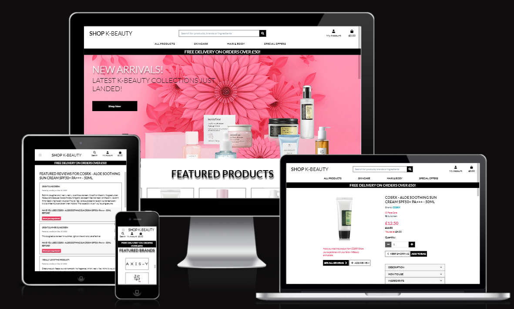
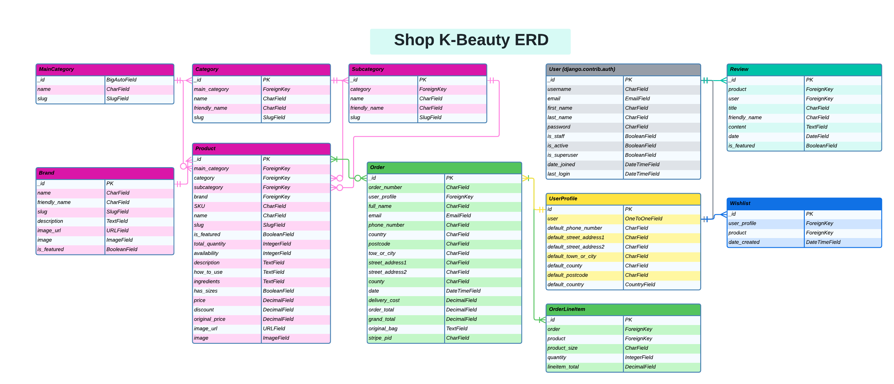

# **SHOP K-BEAUTY**

Shop K-Beauty is an e-commerce store for every lover of K-Beauty skincare, hair & body and makeup lines.

### [Link to the Deployed App](https://shop-k-beauty-django-joy-zadan.herokuapp.com/)

# Project Overview

Shop K-Beauty ...

TABLE OF CONTENTS - Click to Expand

- [USER EXPERIENCE](#user-experience)
    - [Strategy](#strategy)
    - [Scope](#scope)
    - [Structure](#structure)
    - [Skeleton](#skeleton)
    - [Features](#features)
- [Technologies Used](#technologies-used)
- [Testing](#testing)
- [Bugs, Issues and Solutions](#bugs-issues-and-solutions)
- [Deployment](#deployment)
- [Credits](#credits)
- [Acknowledgements](#acknowledgements)

---

# User Experience

## Strategy Plane
### Project Goals
* To develop an App where users can easily find, purchase and add reviews.
* ...
## Scope Plane
### Feature Ideas Planning
When planning the Shop K-Beauty ecommerce store's features and scope, I drew up an Importance Viability analysis of these features, please see below:

| # | Feature | Importance | Viability |
| --- | --- | --- | --- |
| 1 | ... |  |  |
| 2 | ... |  |  |

## Structure Plane
### User Stories
| **USER STORY #** | **ISSUE ID** | **As a/an** | **I want to be able to...** | **So that I can...** |
| --- | --- | --- | --- | --- |
| **VIEWING & NAVIGATION** |   |   |
| 1 | [#9](https://github.com/JoyZadan/shop-kbeauty/issues/9) | Shopper | Navigate around the site | view a list of products  |
| 2 | [#54](https://github.com/JoyZadan/shop-kbeauty/issues/54) | Shopper | View a specific category of products | Quickly find products I'm interested in without having to search through all products. |
| 3 | [#47](https://github.com/JoyZadan/shop-kbeauty/issues/47) | Shopper | Quickly identify deals, clearance items and special offers | Take advantage of special savings on products I'd like to purchase |
| 4 | [#32](https://github.com/JoyZadan/shop-kbeauty/issues/32) | Shopper | Quickly view how much was the original price | Identify how much I may be able to save when buying the product and may also help me compare prices with other sites |
| 5 | [#36](https://github.com/JoyZadan/shop-kbeauty/issues/36) | Shopper | View individual product details | Identify the price, description, product reviews, product image, product ingredients and and instructions how to use product |
| 6 | [#38](https://github.com/JoyZadan/shop-kbeauty/issues/38) | Shopper | Easily view the total of my purchases in the bag at any time | Avoid spending too much |
| 7 | [#28](https://github.com/JoyZadan/shop-kbeauty/issues/28) | Shopper | Easily view the featured brands | To assure me that Shop K-Beauty really offers K-Beauty products from authentic K-Beauty brands |
| 8 | [#48](https://github.com/JoyZadan/shop-kbeauty/issues/48) | Shopper | Search/ View all of the available K-Beauty brands | Look for my favourite brands  |
| 9 | [#70](https://github.com/JoyZadan/shop-kbeauty/issues/70) | Shopper | Easily view details about the brand of a product I am purchasing | Learn more about the brands and feel confident about my purchase |
| 10 | [#73](https://github.com/JoyZadan/shop-kbeauty/issues/73) | Shopper | View a list of available products when viewing the details about a brand | Quickly decide what product to purchase from a particular brand |
| **REGISTRATION & USER ACCOUNTS** |   |   |
| 11 | [#8](https://github.com/JoyZadan/shop-kbeauty/issues/8)| Site User | Easily register for an account | Have a personal account and be able to view my profile |
| 12 | [#52](https://github.com/JoyZadan/shop-kbeauty/issues/52) | Shopper | Receive an email confirmation after registering | View that my personal account registration was successful |
| 13 | [#50](https://github.com/JoyZadan/shop-kbeauty/issues/50) | Shopper | Easily login and logout of my shopper's account | Access my personal account information |
| 14 | [#51](https://github.com/JoyZadan/shop-kbeauty/issues/51) | Shopper | Easily recover my password in case I forget it | Recover access to my account |
| 15 | [#53](https://github.com/JoyZadan/shop-kbeauty/issues/53) | Shopper | Have a personalised user profile | View my personal order history and order confirmations |
| **SORTING & SEARCHING** |   |   |
| 16 | [#31](https://github.com/JoyZadan/shop-kbeauty/issues/31) | Shopper | Sort the list of available products | Easily identiify the best rated, best priced and categorically sorted products |
| 17 | [#54](https://github.com/JoyZadan/shop-kbeauty/issues/54) | Shopper | Sort a specific category of product | Find the best priced or best rated product in a specific category, or sort the products in that categpry by name |
| 18 | [#55](https://github.com/JoyZadan/shop-kbeauty/issues/55) | Shopper | Sort a specific subcategories of products | To easily identify the most suitable product for me to purchase  |
| 19 | [#56](https://github.com/JoyZadan/shop-kbeauty/issues/56) | Shopper | Sort multiple categories of products simultaneously | Find the best priced, special offers or best rated /reviewed products across broad categories, such as "makeup" or "skincare"  |
| 20 | [#29](https://github.com/JoyZadan/shop-kbeauty/issues/29) | Shopper | Search for a product or products by name, by description or by ingredients | Find a specific product I'd like to purchase  |
| 21 | [#57](https://github.com/JoyZadan/shop-kbeauty/issues/57) | Shopper | Easily see what I've searched for and the number of results | Quickly decide whether the product I want is available |
| **PURCHASING & CHECKOUT** |   |   |
| 22 | [#32](https://github.com/JoyZadan/shop-kbeauty/issues/32) | Shopper | Quickly view how much was the original price and what savings, if any are available | Easily compare prices with other sites |
| 23 | [#39](https://github.com/JoyZadan/shop-kbeauty/issues/39) | Shopper | Easily select the size and quantity for a product when purchasing it |Ensure I don't accidentally select the wrong product, quantity or size |
| 24 | [#33](https://github.com/JoyZadan/shop-kbeauty/issues/33) | Shopper | Easily view notifications on screen when I add a product to my bag | Find out immediately if my actions were correct or if the was an error |
| 25 | [#40](https://github.com/JoyZadan/shop-kbeauty/issues/40) | Shopper | View items in my bag to be purchased | Identify the total cost of my purchase and all items I will receive |
| 26 | [#41](https://github.com/JoyZadan/shop-kbeauty/issues/41) | Shopper | Adjust the quantity of individual items in my bag | Easily make changes to my purchase before checkout |
| 27 | [#42](https://github.com/JoyZadan/shop-kbeauty/issues/42) | Shopper | Easily enter my payment information | Check out quickly and with no hassles |
| 28 | [#43](https://github.com/JoyZadan/shop-kbeauty/issues/43) | Shopper | Feel my personal and payment information is safe and secure | Confidently provide the needed information to make a purchase |
| 29 | [#44](https://github.com/JoyZadan/shop-kbeauty/issues/44) | Shopper |View an order confirmation after checkout | Verify that I haven't made any mistakes |
| 30 | [#45](https://github.com/JoyZadan/shop-kbeauty/issues/45) | Shopper | Receive an email confirmation after checking out | Keep the confirmation of what I've purchased for my records |
| **PRODUCT REVIEWS** |   |   |
| 31 | [#64](https://github.com/JoyZadan/shop-kbeauty/issues/64) | Shopper | View available reviews for a product I am viewing  | Find out what others think of the product |
| 32 | [#58](https://github.com/JoyZadan/shop-kbeauty/issues/58) | Shopper | Easily see how I can add my reviews on products I purchased | Decide whether I want to add my review |
| 33| [#71](https://github.com/JoyZadan/shop-kbeauty/issues/71) | Shopper | Easily view/ have access to details about the product I am reviewing | Refer to the information about the product, should I need to do so |
| 34 | [#65](https://github.com/JoyZadan/shop-kbeauty/issues/65) | Shopper | Add my review of the product | Share my personal experienceof using the products  |
| 35 | [#23](https://github.com/JoyZadan/shop-kbeauty/issues/23) | Store Owner | Add Featured Reviews on specific product detail page | Opt to highlight specific reviews |
| 36 | [#66](https://github.com/JoyZadan/shop-kbeauty/issues/66) | Store Owner | Edit submitted reviews | Opt to block off profanities, if any |
| 37 | [#67](https://github.com/JoyZadan/shop-kbeauty/issues/67) | Store Owner | Delete a review | Have control over unacceptable comments such as discriminatory statements, if any |
| **ADMIN & STORE MANAGEMENT** |   |   |
| 38 | [#60](https://github.com/JoyZadan/shop-kbeauty/issues/60) | Store Owner | Add a product | Add new items to my store |
| 39 | [#61](https://github.com/JoyZadan/shop-kbeauty/issues/61) | Store Owner | Edit/update a product | Change product proces, descriptions, ingredients, images and other product criteria |
| 40 | [#62](https://github.com/JoyZadan/shop-kbeauty/issues/62) | Store Owner | Delete a product | Remove items that are no longer for sale |
| 41 | [#72](https://github.com/JoyZadan/shop-kbeauty/issues/72) | I want to have policy pages (privacy, terms & conditions, return & refund and shipping) | Be assured that all the legalities of doing business online are taken care of |
| **DIGITAL MARKETING** |   |   |
| 42 | [#26](https://github.com/JoyZadan/shop-kbeauty/issues/26) | Store Owner | Have a social media presence | Create awareness of Shop K-Beauty products |
| **FOR FUTURE IMPLEMENTATION** |   |   |
| 43| 2 | Shopper |  |  |
| 44 | 2 | Shopper |  |  |
| 45 | 2 | Shopper |  |  |

### Database Schema - Entity Relationship Diagram

### User Journey - Topology Digram

## Skeleton Plan
### Wireframes

## Surface Plane
### Typography
### Colour Scheme
### Imagery

### User Demographic
* Ages 16 and above for viewing, registering and purchasing products
* Visitors who are interested in K-Beauty products
* Visitors who are looking for K-Beauty products
* ...

### User Stories
#### First Time Visitor Goals - As a first time user who has not created an account, I want to be able to:
* Immediately understand the main purpose of ...

#### Registered User Goals - As a registered user, I want to be able to:
* ...

#### Site Admin Goals - As an administrator, I want to be able to:
* Have the ability to ...

Based on the results of the Feature Ideas Planning, I have decided to attempt to implement Features numbers ... for this production release and park the remaining features due to time limitations.

### Functionality Requirements
* ...

## Structure
### Topology Diagrams
...

#### Guest User

#### Registered User
)

#### Superadmin User

## Skeleton
### Wireframes
The wireframes created for this project:
- [DESKTOP - INDEX PAGE]()
- ...

### Design
[Bootstrap4]() was used and customised for the front-end development.

#### Colour Scheme

#### Typography
I used Google Fonts to import the fonts I used across the application.

#### Imagery & UI

The colour scheme and typography used for Shop K-Beauty...

## Features
Breakdown of the features and elements implemented for the App.
### Multi Page Elements
#### Navbar
- ...
- ...

#### Footer
- ...
- ...

#### Home/ Index Page
- ...
- ...

#### Other Pages...
- ...
- ...

#### User and Superadmin Dashboard
- ...
- ...
to do

### Error Handling
The following error handlers were added to the Application to handle possible scenarios requiring specific HTTP Response:
* errorhandler(400) for a Bad Request error
* errorhandler(404) for a 404 Not Found error
* errorhandler(408) for a 408 Request Timeout error
* errorhandler(500) for a 500 Internal Server error

# Technologies Used
* Languages:
    * [HTML5](https://en.wikipedia.org/wiki/HTML5) was used for the content and structure of the site.
    * [CSS3](https://en.wikipedia.org/wiki/CSS#CSS_3) was used for the styling of the site.
    * [JavaScript](https://en.wikipedia.org/wiki/JavaScript) was used for the interactivity of the site.
    * [Python](https://www.python.org/) was used for the back end programming of the site.

* Frameworks and integrated applications:
    * [DJANGO - version 3.2 ](https://docs.djangoproject.com/en/4.1/releases/3.2/) Django is a free and open-source, Python-based web  framework that follows the model–template–views architectural pattern.
    * [DJANGO-ALLAUTH](https://django-allauth.readthedocs.io/en/latest/) is an integrated set of Django applications dealing with account authentication, registration, management, and third-party (social) account authentication

* Databases:
    * [DB.SQLITE3](https://www.postgresql.org/) was the database used for the project (development).
    * [Postgres](https://www.postgresql.org/) Postgres was the relational database used for the project.

* Cloud Storages:
    * [AWS S3](???) was used to store upload images and static files

* Libraries and packages:
* [pip](https://pip.pypa.io/en/stable/)
    * Pip is the package installer for Python, allowing us to install the packages we need for this site.

* [pillow](https://pip.pypa.io/en/stable/)
    * Pillow is the required Python image library used to enable handling of images.

* [dnspython](https://www.dnspython.org/)
    * Dnspython is a DNS toolkit for python.

* [pycodestyle, formerly called pep8](https://pypi.org/project/pycodestyle/)
    * pycodestyle is a tool used to check the Python code against some of the style conventions in PEP 8.

* [Balsamiq](https://balsamiq.com/)
    * Balsamiq was used to create the wireframes for this project.

* [Git](https://git-scm.com/)
    * Git was used for version control and saving work in the repository, using the GitPod extension in Google Chrome to commit to GitHub.

* [Bootstrap 4]()
    * Bootstrap is one of the most popular front-end open source toolkit and was used for ease of styling the Earthlings app.

* [Chrome](https://www.google.com/intl/en_uk/chrome/)
    * This project was created in the Google Chrome browser, and as such Chrome was used as the default testing browser.

* [GitHub](https://github.com/)
    * GitHub is where we host our site.

* Hosting & Deployment
    * [Heroku](https://devcenter.heroku.com/) Heroku is where we deploy this live site. Throughout, we have ensured the version being deployed to Heroku matches the development version by checking features and screen layouts on both versions.
    * [ELEPHANTSQL](https://www.postgresql.org/) ElephantSQL was used to host the the Postgres DB for the project

## Future Implementation
* Include a ...
* ...

# Testing
## All testing undertaken for this project can be found in the [Testing Document](./TESTING.md)

# Bugs, Issues and Solutions [Testing](./TESTING.md)

# Deployment & Local Development

## Deployment to Heroku
To deploy this project, I used Heroku.
1. ...
2. ...

| Key | Value |
| :---: | :---: |
|  |  |
| API_KEY | myapikey |
| API_SECRET | myapisecret |
| IP | 0.0.0.0 |
| PORT | 5000 |
| SECRET_KEY | mysecretkey |
| DATABASE_URL | postgresql |

3. ...
4. ...
5. ...

## Local Development
* How to Fork To fork the repository, use the following steps:
Login or signup to Github and locate the repository.
Click the Fork button in the top right corner
## Making Local Clone
Login or signup to GitHub and locate the GitHub Repository GitHub Repository.
Under the repository name, click "clone" or "download".
To clone the repository using HTTPS, under "Clone with HTTPS", copy the link.
Open the terminal in your preferred code editor and change the current working directory to the location you want to use for the cloned directory.
Type git clone, and then paste the URL you copied in Step 3.
Press Enter. Your clone will be created.

# Credits
## Code
* Credit to Code Institute's Boutique Ado Django ecommerce walkthrough, from which this project was largely based from.
* Credit to [Very Academy YouTube Channel](https://www.youtube.com/c/veryacademy) for the very detailed insights on database models.
* Credit to [Stuart073's Music Box django ecommerce project for the inspiration, particularly for his reviews app](https://github.com/stuartj073/music-box).
* Credit and thanks to [MDBootstrap](https://mdbootstrap.com/docs/b4/jquery/javascript/accordion/) for the accordion on product detail page.
* Credit to [Adam Johnson](https://adamj.eu/tech/2022/10/06/how-to-safely-pass-data-to-javascript-in-a-django-template/) on How to Safely Pass Data to JavaScript in a Django Template.
* Credit to [BugBytes](https://www.youtube.com/watch?v=h39eMGWmEV4) for his video based on Adam Johnson's post.
* Credit to [Stack Overflow](https://stackoverflow.com/questions/226131/how-to-disable-phone-number-linking-in-mobile-safari) for how to disable Safari on mobile auto creating phone number link.

## Content
The product names, images, descriptions and other information were sourced from:
* [SKINSIDER](https://skinsider.co.uk/)
* [STYLEVANA](https://www.stylevana.com/en_GB/)
* [PURESEOUL](https://pureseoul.co.uk/)
* [CULT BEAUTY](https://www.cultbeauty.co.uk/)
* [YESSTYLE](https://www.yesstyle.com/en/home.html)
* [MELON & STARFISH](https://melonandstarfish.com/)
* [K-BEAUTY UK](https://www.k-beauty.co.uk/)
* [TONYMOLY](https://tonymolyonline.co.uk/)
* [UK iHERB](https://uk.iherb.com/)
* [SKINLIBRARY](https://skinlibrary.co.uk/)

The policies were generated from:
* [TERMSFEED](https://www.termsfeed.com/)

The .... for information on the K-Beauty global phenomena.

## Media
* Images used for the project were licensed from Adobe Stock and as per above.

## Resources
1. Code Institute Boutique Ado walkthrough
2. Very Academy
3. Codemy YouTube
4. CodeEx YouTube
5. CodePiep YouTube

# Acknowledgements
A very, very special thanks to my family, especially my daughter Zoe, for the unwavering support and understanding and allowing me the space to focus on my projects.

A big thanks to Conrad Saunders and Chris Booth as SDC for the assist with my EC requests due illness. It's not easy to concentrate and code when stricken with COVID!

A special thank you to [Jason Dunton](https://www.linkedin.com/in/jason-dunton/) from Tutor Support at Code Institute. Jason, thanks for the assist, I appreciate your help!

Special mention and thanks to my mentor, Dario Carrasquel, for his support, invaluable insights and his belief that I can do this well. I am so grateful to have you as my mentor.

# Copyrights
&copy; 2022 SHOP K-BEAUTY by Joy Zadan (An e-commerce Full Stack Developer Project)