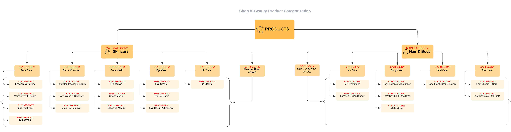

# **SHOP K-BEAUTY**

**[Link to the Deployed Site](https://shop-k-beauty-django-joy-zadan.herokuapp.com/)**

# Project Overview

Shop K-Beauty is a fictitious multi-brand, ecommerce full stack project built using Django, Python, JavaScript and Bootstrap 4. The site is deployed to Heroku, uses Amazon S3 for cloud storage and Stripe for payment processing. Shop K-Beauty is a business to consumer online retailer of K-Beauty skincare and hair &amp; body products.

Shop K-Beauty is my fourth milestone project for Code Institute's Level 5 Diploma in Web Application Development (Full Stack Software Development).
 

---

**TABLE OF CONTENTS**
* [USER EXPERIENCE](#user-experience)
    * [Strategy Plane](#strategy-plane)
        * [Project Goals](#project-goals)
            * [Problems We Are Trying to Solve](#problems-we-are-trying-to-solve)
            * [Internal Stakeholders' Goals](#internal-stakeholders-goals)
            * [Business Model](#business-model)
            * [Product Goals](#product-goals)
            * [User Research](#user-research)
                * [Discovery Phase](#discovery-phase)
                * [Product Launch - Alpha](#product-launch---alpha)
                * [Product Launch - Beta](#product-launch---beta)
    * [Scope Plane](#scope-plane)
        * [Feature Planning](#feature-planning)
        * [Content Requirement Planning](#content-requirement-planning)
            * [Content Type: Text](#content-type-text)
            * [Content Type: Images](#content-type-images)
            * [Content Type: Videos](#content-type-videos)
            * [Integrating Content Strategy and SEO](#integrating-content-strategy-and-seo)
        * [User Stories](#user-stories)
    * [Structure Plane](#structure-plane)
        * [Interaction Design](#interaction-design)
            * [User Flow Diagram](#user-flow-diagram)
        * [Information Architecture](#information-architecture)
            * [Site Map](#site-map)
        * [Database Design](#database-design)
            * [Database ERD](#database-erd)
            * [Data Modelling](#data-modelling)
                * [User Model](#user-model)
                * [UserProfile](#userprofile-model)
                * [MainCategory Model](#maincategory-model)
                * [Category Model](#category-model)
                * [Subcategory Model](#subcategory-model)
                * [Brand Model](#brand-model)
                * [Product Model](#product-model)
                * [Order Model](#order-model)
                * [OrderLineItem Model](#orderlineitem-model)
                * [Review Model](#review-model)
                * [Wishlist Model](#wishlist-model)
    * [Skeleton Plane](#skeleton-plane)
        * [Wireframes](#wireframes)
    * [Surface Plane](#surface-plane)
        * [Typography](#typography)
        * [Colour Palette](#colour-palette)
        * [Imagery](#imagery)
* [Agile Methodology](#agile-methodology)
    * [GitHub Projects](#github-projects)
* [Features](#features)
    * [Product Categorization](#product-categorization)
    * [Stock Keeping Unit (SKU) Architecture](#stock-keeping-unit-sku-architecture)
    * [Defensive Programming](#defensive-programming)
    * [Accessibility](#accessibility)
    * [Extra Meta Tags for Specific Pages](extra-meta-tags-for-specific-pages)
    * [Site Features Common to All Pages](#site-features-common-to-all-pages)
    * [Site Pages](#site-pages)
        * [Home Page](#home-page)
        * [Products Page](#products-page)
        * [Product Detail Page](#product-detail-page)
        * [Brands Page](#brands-page)
        * [Brand Detail Page](#brand-detail-page)
        * [Shopping Bag Page](#shopping-bag-page)
        * [Checkout Page](#checkout-page)
        * [Profile Page](#profile-page)
        * [Reviews Page](#reviews-page)
        * [Add Review Page](#add-review-page)
        * [Review Detail Page](#review-detail-page)
        * [Wishlist Page](#wishlist-page)
        * [Brand Management Page](#brand-management-page)
        * [Product Management Page](#product-management-page)
        * [Privacy Policy Page](#privacy-policy-page)
        * [Terms and Conditions Page](#terms-and-conditions-page)
        * [Return and Refund Policy Page](#return-and-refund-policy-page)
        * [Shipping Policy Page](#shipping-policy-page)
    * [Must Have Features of an Ecommerce Site](#must-have-features-of-an-ecommerce-site)
* [Future Development, Iteration and Implementation](#future-development-iteration-and-implementation)
* [Technologies Used](#technologies-used)
    * [Languages Used](#languages-used)
    * [Frameworks Used](#frameworks-used)
    * [Databases Used](#databases-used)
    * [Libraries and Packages Used](#libraries-and-packages-used)
    * [Programmes and Applications Used](#programmes-and-applications-used)
    * [Payment Processing Platform Used](#payment-processing-platform-used)
    * [Cloud Application Platforms Used](#cloud-platforms-used)
    * [Cloud Storage Services Used](#cloud-storage-services-used)
* [Testing](#testing)
* [Bugs, Issues and Solutions](#bugs-issues-and-solutions)
* [Deployment and Local Development](#deployment-and-local-development)
    * [Deployment](#deployment)
    * [Local Development](#local-development)
        * [How to Fork](#how-to-fork)
        * [How to Clone](#how-to-clone)
* [Credits](#credits)
* [Acknowledgements](#acknowledgements)

---

# User Experience

## STRATEGY PLANE

Straits Research, in its [K-Beauty Products Market Report](https://straitsresearch.com/report/k-beauty-products-market) stated that *"the global K-Beauty products market size had a revenue holding of US$8.30 billion in 2021. It is expected to reach US$18.32 billion by 2030, growing at a CAGR (compound annual growth rate) of 9.2% during the forecast period (2022-2030). Skincare items originating in South Korea are collectively referred to as K-Beauty."*

### **Project Goals**
This section aims to answer the key question: *What problems are we trying to solve with Shop K-Beauty?*

Although the demand for cosmetics products declined globally during the pandemic due mainly to fewer occasions to wear make-up given the guidelines on working from home, social distancing and wearing masks, there was also a corresponding rise in consumption focused on skincare products driven by increasing demand for affordable, fast-acting, self-care beauty routines.

#### **Problems We Are Trying to Solve**
- *Problem 1: Convenient access to effective K-Beauty products that can be used at home without the help of medical aesthetician*

Shop K-Beauty, a multi-brand ecommerce store specialising in K-Beauty skincare and hair &amp; body products, aims to provide an easy to use online shop for consumers to browse and purchase K-Beauty products. These curated K-Beauty products are proven to be effective, gentle on the skin, and can be used at home without requiring the assistance of a skincare professional.

- *Problem 2: Confusion around K-Beauty products and K-Beauty Skincare routines*

Shop K-Beauty also aims to provide the information that consumers may require such as a product description, how to use a product and detailed product ingredients. With an uncluttered, easy to follow product detail and with our K-Beauty tips, we hope to also demystify the ins and outs of K-Beauty skincare routines.

In addition, a brief information about a product brand's company background, ethos and values will also be made available to all visitors and shoppers.

- *Problem 3: Expensive skincare and hair &amp; body products*

Cognizant of ever-increasing costs of living and typically high price points of skincare and hair &amp; body products available in the UK, Europe, Middle East and the USA, Shop K-Beauty aims to offer more affordable products without sacrificing quality, effectiveness and enjoyability. K-Beauty products are generally already attractively priced compared to their Western counterparts and whenever possible, product discounts, deals and offers will be available on the Shop.

- Update:
1. Brand
2. Reviews
3. Wishlist
4. Search for specific ingredients
5. Improved Navigation to include subcategories for each category of products

#### **Internal Stakeholders' Goals**
Ultimately, the internal stakeholders' goal is to have a profitable and positively-perceived online shop specialising in K-Beauty products. Internal stakeholders are the shop owners, online shop administrators and staff (the latter two may also be the shop owners themselves).

To achieve the above, the internal stakeholders' goals for the ecommerce shop are focused on:
1. **Trustworthiness** - How can the online shop effectively present the trustworthiness and the high quality of the available K-Beauty products?
2. **Simplicity and Ease of Use** - How can the quality of the content presented to end-users (shop visitors and shoppers) be easy to follow, engaging and provides balanced information and detail without being overwhelming or distracting?
3. **Transparency** - How can we unsure that our contact information, the policies for shipping, returns and privacy and product reviews are easy to find?

Source: [Web Designer Depot's Ultimate Guide to Designing ECommerce Websites](https://www.webdesignerdepot.com/2014/06/the-ultimate-guide-to-designing-ecommerce-websites/)

#### **Business Model**
Shop K-Beauty is a Business to Consumer (B2C) direct sellers of multiple brands of K-Beauty products.

#### **Product Goals**
1. Proven Effectiveness - evidenced by user reviews
2. Branded Products - inclusion of product brand and brand description
3. Attractive Price Points - through price competiveness and savings on offer

#### **User Research**
What is user research? User research is the process of researching Shop K-Beauty's potential users what K-Beauty products they want and will feel good about using. For the Shop K-Beauty project, user research will be done in three phases: Discovery Phase, Product Launch - Alpha, and Product Launch - Beta.

- #### **Discovery Phase**
    During the discovery phase of User Research, to begin with, we asked several participants from a skincare enthusiasts on Facebook: [The Ordinary Skincare Fans (UK/US/Europe)](https://www.facebook.com/groups/theordinaryskincarefans) and two K-Beauty skincare product users (known to the developer) to ask them several qualitative questions:
    1. Qualifying question: Have you heard of / use K-Beauty skincare products?   
        Those who answered yes were then asked asked the next question:
    2. Would you like to participate in an informal user research about K-Beauty products?   
        Those who answered yes were then asked asked the next set of qualitative questions:
    3. Where do you normally purchase these products? From a pharmacy/ beauty shop or online?  
        *Answers received:*
        - online
        - pharmacy/ physical store
        - both online and physical shop
    4. How might we help you find K-Beauty products?   
        *Answers received:*
        - Post them on social media
        - create helpful skincare groups on social media
        - send your products to 'skinfluencers' for reviews
    5. How might we provide you the information that you typically look for when buying a skincare and/or hair &amp; beauty products?   
        *Answers received:*
        - name
        - price
        - brand name
        - description
        - how to use
        - ingredients
        - skincare concern
        - discounts
        - reviews
        - availability
        - delivery charge
    6. How might we help you decide on the trustworthiness of a K-Beauty product you are thinking of buying?   
        *Answers received*:
        - brand name and information
        - products from a particular brand
        - product reviews and ratings
    7. Once you have found the product you are looking for, how might we help you make the decision to purchase the product?   
        *Answers received:*
        - Show me what discounts are available
        - I want to see deals
        - I want to read reviews about the product so that I can check if it's gentle on the skin/ is effective
        - Show me related products in case I'm still not convinced
    8. How might we help you come back to make the purchase in case you did not buy the products from your visit?   
        *Answers received:*
        - Just let me save the product to my wishlist
        - Email me a reminder
        - Post it on your social media so I can follow you/ remember to buy

- #### **Product Launch - Alpha**
    This is to be conducted after initial deployment. Alpha testing will assess the quality and stability of the site under test in the testing environment.

    The Product Launch - Alpha will be focused on:
    1. Uncovering bugs
    2. Usability issues
    3. Feature gaps
    4. Compatibility/ inter-operability issues

    Source: [Software Testing Helps - Alpha Testing](https://www.softwaretestinghelp.com/alpha-testing/)  

    Update:

- #### **Product Launch - Beta**
    Beta Testing will be conducted after the issues arising from the results of the Alpha Testing have been fixed. Beta Testing is one of the Customer Validation methodologies to evaluate the level of customer satisfaction with the product through the validations by end-users and asking them for feedback on the design, functionality and usabilility of the site, Shop K-Beauty.

    Source: [Software Testing Helps - Alpha Testing](https://www.softwaretestinghelp.com/beta-testing/) 
    Source: [Google's HEART* Framework for Measuring UX](https://storage.googleapis.com/pub-tools-public-publication-data/pdf/36299.pdf)
    * HEART stands for Happiness, Engagement, Adoption, Retention, Task Success

    Update:

## SCOPE PLANE
### **Feature Planning**
When planning the Shop K-Beauty ecommerce store's features and scope, I drew up a Desirability, Importance and  Viability analysis of all the possible features to be included in the project, ranking them by order of importance from low (1) to high (5). Features that ranked the highest will be prioritised and should they have been delivered within this release, will then be marked accordingly so. The target users for each ranked feature are also identified.

| # | Feature | Target User | Desirability | Importance | Viability  | Delivered |
| --- | --- | --- | --- | --- | --- | --- |
| User Accounts |  |  |  |  |  |  |
| 1 | User Role Permissions | All Users 1 | 5 | 5 | 5 | ✅ |
| 2 | Account Registration | All Users 1 | 5 | 5 | 5 | ✅ |
| 3 | User Email Confirmation | All Users 1 | 5 | 5 | 5 | ✅ |
| 4 | Password Reset | All Users 1 | 5 | 5 | 5 | ✅ |
| 5 | Social Media Registration &amp; Login | Visitors &amp; Shoppers | 5 | 2 | 2 | ❌ |
| 6 | User Profile Page | Registered Users | 5 | 5 | 5 | ✅ |
| Navigation |  |  |  |  |  |  |
| 7 | Top Navigation to include: logo, search bar, my account (register, login) and bag | All Users 1 | 5 | 5 | 5 | ✅ |
| 8 | Top Navigation to include: my account (my profile, logout), wishlist | Logged In Users | 5 | 5 | 5 | ✅ |
| 9 | Top Navigation Search Bar: to be enabled for product name, brands or ingredients searching | All Users 1 | 5 | 5 | 5 | ✅ |
| 10 | Top Navigation to include: my account (brand management, product management, my profile, logout) and wishlist | Logged In Shop Owners &amp; Superadmins | 5 | 5 | 5 | ✅ |
| 11 | Main Navigation to include links to: all products, product types by categories, special offers and available brands | All Users 1 | 5 | 5 | 5 | ✅ |
| Products |  |  |  |  |  |  |
| 12 | Featured Products | All Users 1 | 5 | 5 | 5 | ✅ |
| 13 | Product Main Categories | All Users 1 | 5 | 5 | 5 | ✅ |
| 14 | Product Categories | All Users 1 | 5 | 5 | 5 | ✅ |
| 15 | Product Subcategories | All Users 1 | 5 | 5 | 5 | ✅ |
| 16 | Product Detail page to include: link to brands, categories and subcategories, accordion to contain description, how to use and ingredient details | All Users 1 | 5 | 5 | 5 | ✅ |
| 17 | Product Subcategories | All Users 1 | 5 | 5 | 5 | ✅ |
| 18 | Randomized List of Related Products (filtered by subcategory) | All Users 1 | 5 | 4 | 3 | ✅ |
| 19 | Product Management - Create, Read, Update and Delete Products via the front-end | Shop Owners &amp; Superadmins | 5 | 5 | 5 | ✅ |
| Brands |  |  |  |  |  |  |
| 20 | Featured Brands | All Users 1 | 5 | 5 | 5 | ✅ |
| 21 | List of All Available Brands | All Users 1 | 5 | 5 | 5 | ✅ |
| 22 | List of All Available Products by Brand | All Users 1 | 5 | 5 | 5 | ✅ |
| 23 | Brand Management - Create, Read, Update Brands via the front-end | Shop Owners &amp; Superadmins | 5 | 5 | 5 | ✅ |
| Stock Inventory |  |  |  |  |  |  |
| 24 | Display Percentage of Stock Availability against Total Quantity of Stocks Per Product  | All Users 1 | 3 | 3 | 3 | ❌ |
| 25 | Automatically Deduct quantity of product sold from Total Quantity and Update Stock Availability Displayed on Product Detail Page | All Users 1 | 4 | 2 | 2 | ❌ |
| 26 | Design SKUs to Conform with both Stock Inventory and Pick and Pack Fulfillment 2 | Shop Owners &amp; Superadmin | 5 | 5 | 5 | ✅ |
| Checkout |  |  |  |  |  |  |
| 27 | Email Confirmation of Order | Shoppers | 5 | 5 | 5 | ✅ |
| 28 | Order History | Shoppers | 5 | 5 | 5 | ✅ |
| 29 | Save/ Update Customer Details on Checkout | Shoppers | 5 | 5 | 5 | ✅ |
| Product Reviews |  |  |  |  |  |  |
| 30 | Product Reviews - Create and Read Reviews | Logged In Users  |  5 | 5 | 5 | ✅ |
| 31 | Product Reviews - Create, Read Update and Delete Reviews | Shop Owners and Superadmins (CRUD) |  5 | 5 | 5 | ✅ |
| Wishlist |  |  |  |  |  |  |
| 32 | Individual User's Wishlist - Create, Read, Update and Delete Wishlist | Logged In Users | 5 | 5 | 5 | ✅ |
| 33 | Policy Pages | All Users 1 | 5 | 5 | 5 | ✅ |
| Digital Marketing |  |  |  |  |  |  |
| 34 | Social Media Presence | Shop Owners &amp; Superadmins | 5 | 5 | 5 | ✅ |
| Email Marketing |  |  |  |  |  |  |
| 35 | Email Subscription, Powered by MailChimp | Registered Subscribers | 3 | 3 | 3 | ❌ |
| Contact Us |  |  |  |  |  |  |
| 36 | Contact Form | All Users 1 | 3 | 3 | 3 | ❌ |
| Loyalty, Gift Cards and Discount Vouchers |  |  |  |  |  |  |
| 37 | Loyalty Cards | Shoppers | 4 | 3 | 2 | ❌ |
| 38 | Digital Gift Cards | All Users 1 | 5 | 2 | 1 | ❌ |
| 39 | Digital Discount Vouchers | All Users 1 | 5 | 2 | 1 | ❌ |
| Other Features |  |  |  |  |  |  |
| 40 | SEO Friendly URLs - use slugs for URLs vs IDs such as product id, review id, brand id for better SEO | All Users 1 | 3 | 5 | 2 | ❌ |

1. All Users: Site Visitors, Logged In Users, Shop Owners, Superadmins

2. Source: [James and James Ecommerce Fulfillment: What is SKU and how are they used by retailers?](https://www.ecommercefulfilment.com/en/scale-up/sku-important-many-need/)

### **Content Requirement Planning**
*Design in the absence of content is not design, it's decoration.* - [Jeffrey Zeldman](https://en.wikipedia.org/wiki/Jeffrey_Zeldman)

Whilst Content Strategy and Planning are not technically a part of UX, content bridges the gap between the Business Goals and the end users. Having a clear vision of what we need to achieve (ie the type of content that relates to the users and satisfies their needs) and a roadmap for how exactly we can get there (by understanding the users and creating quality content) are as equally important as having a good understand of the Features we want to implement. - [UX Collective](https://uxdesign.cc/content-strategy-in-ux-design-c2e41d19d447)

Earlier, we discussed the Internal Stakeholders' Goals -- a profitable, positively-perceived specialist online shop focused on delivering: Trustworthiness, Simplicity and Ease of Use, Transparency.

Meanwhile, from our User Research (Discovery Phase), we found out that shoppers of skincare and hair &amp; body products typically look specific information when buying these products.

- #### **Content Type: Text**
| # | Information a Shopper Needs to Make a Buying Decision | Delivered |
| --- | --- | --- |
| 1 | Brand Name  | ✅ |
| 2 | Brand's Products  | ✅ |
| 3 | Brand's Product to Aid with Skincare Concern  | ✅ |
| 4 | Product Price | ✅ |
| 5 | Product Description | ✅ |
| 6 | Product's Ingredients  | ✅ |
| 7 | How to Use the Product  | ✅ |
| 8 | Product Discounts | ✅ |
| 9 | Delivery Fees | ✅ |
| 10 | Promotional Codes and Discounts | ✅ |
| 11 | Product Reviews | ✅ |
| 12 | Additional Info: Skincare Routines and Tips | ✅ |

- #### **Content Type: Images**
| # | Image(s) a Shopper Needs to Make a Buying Decision | Why? | Delivered |
| --- | --- | --- | --- |
| 1 | Product Image | To make sure it's the correct product | ✅ |
| 2 | Brand Logo | To make sure it's the correct brand or the brand I had in mind | ✅ |

- #### **Content Type: Videos**
| # | Videos a Shopper Needs to Make a Buying Decision | Why? | Delivered |
| --- | --- | --- | --- |
| 1 | Product Review | To help user decide to purchase the product or looking for something else | ❌ |
| 2 | Skincare Routine - How To | To be sure of following the right steps, of correctly layering the serums and other products | ❌ |

- #### **Integrating Content Strategy and SEO**
**Shop K-Beauty's on-page SEO (search engine optimization) requirements**

| Page | Page Title | Page Description & Length (50-158 char) | Target Keyword(s) | Internal Links | Calls to Action |
| --- | --- | --- | --- | --- | --- |
| Home | Shop K-Beauty | Shop K-Beauty is an online shop for your K-Beauty needs. View our range of affordable &amp; leading selection of Korean skincare and hair &amp; body products! (158) | K-beauty, skincare, hair &amp; body products, skincare routine, serums, ampoules, glass skin, essence, sunscreen, younger-looking skin | New Arrivals, Product Detail, Brand Detail | Shop Now |
| Products | All K-Beauty Products + Shop K-Beauty | Discover our wide range of affordable and leading selection of Korean skincare and hair & body products that will help your skin look and feel amazing! (151) | Korean skincare, Korean hair &amp; body products | Product Detail, links to categories and subcategories | Shop Now |
| Product Detail | Product Name + Shop K-Beauty | From serums to treatment ampoules, we offer a wide-range of affordable and leading selection of K-Beauty products for all your skincare routines. (145) | K-beauty skincare, K-beauty hair &amp; body products, affordable K-beauty products | Product Brand, Product Category and Subcategory | Update Item Quantity, Remove Item, Keep Shopping, Add to Bag, Wishlist, See All Reviews, Add Review, Shop Now |
| Add Product | Product Management - Add Product + Shop K-Beauty | For Authorized Personnel Only. Add a new product to the store. Shop K-Beauty is an online shop for all your K-Beauty needs. (123) | K-beauty, skincare, hair &amp; body products, affordable K-beauty products | Products | Add Product  |
| Edit Product | Product Management - Edit Product + Shop K-Beauty | For Authorized Personnel Only. Edit an existing product. Shop K-Beauty is an online shop for all your K-Beauty needs. (118) | K-beauty, skincare, hair &amp; body products, affordable K-beauty products | Products | Edit Product  |
| Brands | All K-Beauty Brands + Shop K-Beauty | Discover our wide range of leading selection of K-Beauty brands. Shop K-Beauty is an online shop specialising in K-Beauty skincare, hair and body products. (155) | K-beauty, k-beauty brands, k-beauty skincare, k-beauty hair &amp; body products | Brand detail | View All Products |
| Brand Detail | Brand Name + Shop K-Beauty | From Axis-Y to The Vegan Glow, from skincare to hair and body products, we stock a wide-range of affordable and leading selection of K-Beauty brands. (149) | K-beauty, k-beauty brands, k-beauty skincare, k-beauty hair &amp; body products | Product Category and Subcategory | Shop Now |
| Add Brand | Brand Management - Add Brand + Shop K-Beauty | For Authorized Personnel Only. Add a new brand to the store. Shop K-Beauty is an online shop for all your K-Beauty needs. (121) | K-beauty, K-beauty brands, skincare, hair & body products, affordable K-beauty brands | Brands | Add Brand |
| Edit Brand | Brand Management - Edit Brand + Shop K-Beauty | For Authorized Personnel Only. Edit an existing brand. Shop K-Beauty is an online shop for all your K-Beauty needs. (115) | K-beauty, K-beauty brands, skincare, hair & body products, affordable K-beauty brands | Brands | Edit Brand |
| Bag | Shopping Bag + Shop K-Beauty | From serums to treatment ampoules, we offer a wide-range of affordable and leading selection of K-Beauty products for all your skincare routines. (145) | K-beauty skincare, K-beauty hair & body products, affordable K-beauty products | Products, Checkout | Update Item Quantity, Remove Item, Keep Shopping, Secure Checkout |
| Checkout | Checkout + Shop K-Beauty | Shop K-Beauty's payments processing is powered by Stripe, offering secure and encrypted protection. Shop K-Beauty is an online shop for your K-Beauty needs. (156) | K-beauty, k-beauty products, skincare, hair &amp; body products, secure payments | Account Signup, Account Login, Forgot Password?, View Bag | Save Info, Adjust Bag, Complete Order |
| Checkout Success | Checkout Success! + Shop K-Beauty | Thank you for shopping at Shop K-Beauty, the online shop for all your K-Beauty needs. View our range of affordable and leading selection of K-Beauty products! (158) | K-beauty, k-beauty products, skincare, hair &amp; body products | Profile, Products/All Special Offers | Back to Profile, Check out the latest deals |
| Accounts/Signup | Signup + Shop K-Beauty | Sign up with Shop K-Beauty and explore our wide range of affordable and leading selection of K-beauty products that will help your skin look and feel amazing! (159) | K-beauty, skincare, hair &amp; body products, serums, ampoules, glass skin, essence, younger-looking skin, discounts, deals, sale, skincare routine, k-beauty tips | Login | Back to Login, Sign Up |
| Accounts/Login | Login + Shop K-Beauty | Log in to your account with Shop K-Beauty and explore our wide range of affordable and leading selection of K-beauty skincare and hair and body products! (153) | K-beauty, skincare, hair & body products, serums, ampoules, essence, discounts, deals, wishlist, reviews, skincare routine, k-beauty tips | Sign Up, Forgot Password?, Home Page | Login, Go to Home Page |
| Accounts/Logout | Logout + Shop K-Beauty | Shop K-Beauty is an online shop for your K-Beauty needs. View our range of affordable & leading selection of Korean skincare and hair & body products! (158) | K-beauty, skincare, hair & body products, skincare routine, serums, ampoules, glass skin, essence, sunscreen, younger-looking skin | none | Sign Out, Confirm Sign Out, Cancel |
| Profile | Profile + Shop K-Beauty | For Logged In Users Only. View your Shop K-Beauty order history; create, add to or edit your wish list. Discover our wide range of leading K-Beauty products! (157) | K-beauty, create your k-beauty products wish list, k-beauty skincare routines, hair &amp;body k-beauty products  | Wishlist, Order History | Go to Wishlist, Update Information |
| Reviews | All Available Reviews for (Product Name) + Shop K-Beauty | Shop K-Beauty is an online shop for all your K-Beauty needs. Discover what other skin enthusiasts have to say about using K-Beauty products! (140) | K-beauty, effective k-beauty products, k-beauty product reviews, k-beauty skincare, affordable k-beauty products | Login | Share Your Experience |
| Add Reviews | Add Review + Shop K-Beauty | For Logged In Users Only. Shop K-Beauty is an online shop for all your K-Beauty needs. Share your experience using our wide range of leading K-Beauty products! (159) | K-beauty, effective k-beauty products, k-beauty product reviews, k-beauty skincare, affordable k-beauty products | Home, Login, Forgot Password? | Add Review |
| Reviews/ Edit Reviews | Edit a Review + Shop K-Beauty | For Authorized Personnel Only. Your opinions on K-Beauty products are important to our community of skin enthusiasts. We only edit reviews for profane terms. (157) | K-beauty, effective k-beauty products, k-beauty product reviews, k-beauty skincare, affordable k-beauty products | Home, Login, Forgot Password? | Add Review |
| Wishlist | Wishlist + Shop K-Beauty | For Logged In Users. Shop K-Beauty is an online shop for your K-Beauty needs. Create your wish list of K-Beauty products and don't miss out on great deals! (155) | K-beauty, skincare, k-beauty wish list, serums, ampoules, glass skin, essence, younger-looking skin, discounts, deals | Wishlist Product Detail | Shop Now, Remove from Wishlist |
| K-Beauty Tips | K-Beauty Tips + Shop K-Beauty | What is K-Beauty? Here's everything you need to know. Discover great K-Beauty products, skincare routines and tips from people we love here at Shop K-Beauty! (157) | K-beauty, skincare, hair & body products, skincare routine, serums, ampoules, glass skin, essence, sunscreen, younger-looking skin | Products | Keep Shopping |
| Privacy Policy | Privacy Policy + Shop K-Beauty | Here's everything you need to know about how we collect, store and manage our customers' data. Shop K-Beauty is an online shop for all your K-Beauty needs. (155) | K-beauty, Shop K-Beauty, privacy policy, customer data, skincare products, hair &amp; body products | Home | none |
| Terms & Conditions | Terms and Conditions + Shop K-Beauty | Terms and Conditions. These Terms apply to all visitors, users and others who access or use our Site. Shop K-Beauty is an online shop for your K-Beauty needs. (158) | K-beauty, Shop K-Beauty, terms and conditions, skincare products, hair &amp; body products  | Home | none |
| Return & Refund Policy | Return and Refund + Shop K-Beauty | Here's everything you need to know about your Order Cancellation Rights, Conditions for Returns, Goods Marked as Gifts and how to contact Shop K-Beauty. (152) | K-beauty, Shop K-Beauty, return and refund policy, skincare products, hair &amp; body products | Home | none |
| Shipping Policy | Shipping Policy + Shop K-Beauty | Here's what you need to know about our Domestic and International Shipping Policy, the Shipping Rates and Delivery Estimates and how to contact Shop K-Beauty.(158) | K-beauty, Shop K-Beauty, domestic and international shipping policy, order delivery, skincare products, hair &amp; body products | Home | none |

The site's footer will contain links to social media pages of Shop K-Beauty as well as the policy pages.

Source: [HubSpot's Complete SEO Starter Pack](https://offers.hubspot.com/seo-starter-pack?hubs_post-cta=anchor&hubs_post=blog.hubspot.com%2Fmarketing%2Fseo-strategy&hubs_signup-url=blog.hubspot.com%2Fmarketing%2Fseo-strategy&hubs_content=blog.hubspot.com%2Fmarketing%2Fseo-strategy&hubs_signup-cta=cta_button&hubs_content-cta=cta_button&hsCtaTracking=1d7211ac-7b1b-4405-b940-54b8acedb26e%7C882f38ab-3d08-4abe-b1c9-fed6ebc3579f)

### **User Stories**
| **USER STORY #** | **ISSUE ID** | **As a/an** | **I want to be able to...** | **So that I can...** |
| --- | --- | --- | --- | --- |
| **VIEWING & NAVIGATION** |   |   |
| 1 | [#9](https://github.com/JoyZadan/shop-kbeauty/issues/9) | Shopper | Navigate around the site | View a list of products  |
| 2 | [#54](https://github.com/JoyZadan/shop-kbeauty/issues/54) | Shopper | View a specific category of products | Quickly find products I'm interested in without having to search through all products. |
| 3 | [#47](https://github.com/JoyZadan/shop-kbeauty/issues/47) | Shopper | Quickly identify deals, clearance items and special offers | Take advantage of special savings on products I'd like to purchase |
| 4 | [#32](https://github.com/JoyZadan/shop-kbeauty/issues/32) | Shopper | Quickly view how much was the original price | Identify how much I may be able to save when buying the product and may also help me compare prices with other sites |
| 5 | [#36](https://github.com/JoyZadan/shop-kbeauty/issues/36) | Shopper | View individual product details | Identify the price, description, product reviews, product image, product ingredients and and instructions how to use product |
| 6 | [#38](https://github.com/JoyZadan/shop-kbeauty/issues/38) | Shopper | Easily view the total of my purchases in the bag at any time | Avoid spending too much |
| 7 | [#28](https://github.com/JoyZadan/shop-kbeauty/issues/28) | Shopper | Easily view the featured brands | To assure me that Shop K-Beauty really offers K-Beauty products from authentic K-Beauty brands |
| 8 | [#48](https://github.com/JoyZadan/shop-kbeauty/issues/48) | Shopper | Search/ View all of the available K-Beauty brands | Look for my favourite brands  |
| 9 | [#70](https://github.com/JoyZadan/shop-kbeauty/issues/70) | Shopper | Easily view details about the brand of a product I am purchasing | Learn more about the brands and feel confident about my purchase |
| 10 | [#73](https://github.com/JoyZadan/shop-kbeauty/issues/73) | Shopper | View a list of available products when viewing the details about a brand | Quickly decide what product to purchase from a particular brand |
| 11 | [#81](https://github.com/JoyZadan/shop-kbeauty/issues/81) | Shopper | Find skincare tips and information about K-Beauty skincare routine | Decide which products I need to purchase |
| 12 | [#82](https://github.com/JoyZadan/shop-kbeauty/issues/82) | Shopper | Easily navigate from a product category to the corresponding subcategories | Easily find the products I am looking for |
| 13 | [#89](https://github.com/JoyZadan/shop-kbeauty/issues/89) | Shopper | View Related products | Make a more informed decision before finalising my purchase |
| **REGISTRATION & USER ACCOUNTS** |   |   |
| 14 | [#8](https://github.com/JoyZadan/shop-kbeauty/issues/8)| Site User | Easily register for an account | Have a personal account and be able to view my profile |
| 15 | [#52](https://github.com/JoyZadan/shop-kbeauty/issues/52) | Shopper | Receive an email confirmation after registering | View that my personal account registration was successful |
| 16 | [#50](https://github.com/JoyZadan/shop-kbeauty/issues/50) | Shopper | Easily login and logout of my shopper's account | Access my personal account information |
| 17 | [#51](https://github.com/JoyZadan/shop-kbeauty/issues/51) | Shopper | Easily recover my password in case I forget it | Recover access to my account |
| 18 | [#53](https://github.com/JoyZadan/shop-kbeauty/issues/53) | Shopper | Have a personalised user profile | View my personal order history and order confirmations |
| **SORTING & SEARCHING** |   |   |
| 19 | [#31](https://github.com/JoyZadan/shop-kbeauty/issues/31) | Shopper | Sort the list of available products | Easily identiify the best rated, best priced and categorically sorted products |
| 20 | [#54](https://github.com/JoyZadan/shop-kbeauty/issues/54) | Shopper | Sort a specific category of product | Find the best priced or best rated product in a specific category, or sort the products in that categpry by name |
| 21 | [#55](https://github.com/JoyZadan/shop-kbeauty/issues/55) | Shopper | Sort a specific subcategories of products | To easily identify the most suitable product for me to purchase  |
| 22 | [#56](https://github.com/JoyZadan/shop-kbeauty/issues/56) | Shopper | Sort multiple categories of products simultaneously | Find the best priced, special offers or best rated /reviewed products across broad categories, such as "makeup" or "skincare"  |
| 23 | [#29](https://github.com/JoyZadan/shop-kbeauty/issues/29) | Shopper | Search for a product or products by name, by description or by ingredients | Find a specific product I'd like to purchase  |
| 24 | [#57](https://github.com/JoyZadan/shop-kbeauty/issues/57) | Shopper | Easily see what I've searched for and the number of results | Quickly decide whether the product I want is available |
| **PURCHASING & CHECKOUT** |   |   |
| 25 | [#32](https://github.com/JoyZadan/shop-kbeauty/issues/32) | Shopper | Quickly view how much was the original price and what savings, if any are available | Easily compare prices with other sites |
| 26 | [#39](https://github.com/JoyZadan/shop-kbeauty/issues/39) | Shopper | Easily select the size and quantity for a product when purchasing it |Ensure I don't accidentally select the wrong product, quantity or size |
| 27 | [#33](https://github.com/JoyZadan/shop-kbeauty/issues/33) | Shopper | Easily view notifications on screen when I add a product to my bag | Find out immediately if my actions were correct or if the was an error |
| 28 | [#40](https://github.com/JoyZadan/shop-kbeauty/issues/40) | Shopper | View items in my bag to be purchased | Identify the total cost of my purchase and all items I will receive |
| 29 | [#41](https://github.com/JoyZadan/shop-kbeauty/issues/41) | Shopper | Adjust the quantity of individual items in my bag | Easily make changes to my purchase before checkout |
| 30 | [#42](https://github.com/JoyZadan/shop-kbeauty/issues/42) | Shopper | Easily enter my payment information | Check out quickly and with no hassles |
| 31 | [#43](https://github.com/JoyZadan/shop-kbeauty/issues/43) | Shopper | Feel my personal and payment information is safe and secure | Confidently provide the needed information to make a purchase |
| 32 | [#44](https://github.com/JoyZadan/shop-kbeauty/issues/44) | Shopper |View an order confirmation after checkout | Verify that I haven't made any mistakes |
| 33 | [#45](https://github.com/JoyZadan/shop-kbeauty/issues/45) | Shopper | Receive an email confirmation after checking out | Keep the confirmation of what I've purchased for my records |
| **PRODUCT REVIEWS** |   |   |
| 34 | [#64](https://github.com/JoyZadan/shop-kbeauty/issues/64) | Shopper | View available reviews for a product I am viewing  | Find out what others think of the product |
| 35 | [#58](https://github.com/JoyZadan/shop-kbeauty/issues/58) | Shopper | Easily see how I can add my reviews on products I purchased | Decide whether I want to add my review |
| 36| [#71](https://github.com/JoyZadan/shop-kbeauty/issues/71) | Shopper | Easily view/ have access to details about the product I am reviewing | Refer to the information about the product, should I need to do so |
| 37 | [#65](https://github.com/JoyZadan/shop-kbeauty/issues/65) | Shopper | Add my review of the product | Share my personal experienceof using the products  |
| 38 | [#23](https://github.com/JoyZadan/shop-kbeauty/issues/23) | Store Owner | Add Featured Reviews on specific product detail page | Opt to highlight specific reviews |
| 39 | [#66](https://github.com/JoyZadan/shop-kbeauty/issues/66) | Store Owner | Edit submitted reviews | Opt to block off profanities, if any |
| 40 | [#67](https://github.com/JoyZadan/shop-kbeauty/issues/67) | Store Owner | Delete a review | Have control over unacceptable comments such as discriminatory statements, if any |
| **ADMIN & STORE MANAGEMENT** |   |   |
| 41 | [#60](https://github.com/JoyZadan/shop-kbeauty/issues/60) | Store Owner | Add a product | Add new items to my store |
| 42 | [#61](https://github.com/JoyZadan/shop-kbeauty/issues/61) | Store Owner | Edit/update a product | Change product proces, descriptions, ingredients, images and other product criteria |
| 43 | [#62](https://github.com/JoyZadan/shop-kbeauty/issues/62) | Store Owner | Delete a product | Remove items that are no longer for sale |
| 44 | [#72](https://github.com/JoyZadan/shop-kbeauty/issues/72) | Store Owner | Use/ have policy pages (privacy, terms & conditions, return & refund and shipping) | Be assured that all the legalities of doing business online are taken care of |
| 45 | [#76](https://github.com/JoyZadan/shop-kbeauty/issues/76) | Store Owner | Receive a warning if I accidentally click the delete a product button | Avoid accidental deletion of a product |
| 46 | [#83](https://github.com/JoyZadan/shop-kbeauty/issues/83) | Store Owner | Add a brand to my store | Add new products even if the product's brand is not in the store yet |
| 47 | [#84](https://github.com/JoyZadan/shop-kbeauty/issues/84) | Store Owner | Edit/ Update a brand in my store | Make changes to a brand name, description, brand logo or choose to feature a brand |
| **DIGITAL MARKETING** |   |   |
| 48 | [#26](https://github.com/JoyZadan/shop-kbeauty/issues/26) | Store Owner | Have a social media presence | Create awareness of Shop K-Beauty products |
| **USER'S WISHLIST** |   |   |
| 49 | [#85](https://github.com/JoyZadan/shop-kbeauty/issues/85) | Shopper | Easily add a product to my wishlist | Save it for future purchase or reference |
| 50 | [#87](https://github.com/JoyZadan/shop-kbeauty/issues/87) | Shopper | Easily remove a product from my wishlist | Keep pnly the products I'm interested in |
| **FOR FUTURE IMPLEMENTATION** |   |   |
| 51| # | Shopper | register an account via social account | easy registration |
| 52 | # | Shopper | login via social account | avoid having to keep track of login details |
| 53 | # | Shop Owner | stock inventory app | keep track of current total quantity less products sold and update current availability |

## STRUCTURE PLANE
### **Interaction Design**
#### **User Flow Diagram**

### **Information Architecture**
#### **Site Map**
Shop K-Beauty's visualized site map was autogenerated using [Visual Site Maps](https://visualsitemaps.com). Although a pdf version is available, it is a rather large file at nearly 8k KB, so it is not included in the documentation. Please click on the link below to view the generated site map, instead.

[Shop K-Beauty's visualized site map](https://app.visualsitemaps.com/share/9c3962303808df14558c21ac015c946c)

Choose to expand or collapse the site map using the [icons on the top right hand side of the screen](./documentation/diagrams/shop-k-beauty-visualized-site-map-control-viewing-icons.png). The visualized site map can be expanded or collapsed, organized by directory or by first found referral. It is also possible to switch between vertical or horizontal orientation.

### **Database Design**
When designing an efficient, useful database for Shop K-Beauty, we followed the following phases:
1. Requirements Analysis - identifying the purpose of the database
2. Organizing data into tables - determining the database structure
3. Normalizing to standardize the tables

Source: [Lucidcart Database Diagram/ Database Design](https://www.lucidchart.com/pages/database-diagram/database-design)

How were these phases conducted and completed?
1. Requirements Analysis - identifying the purpose of the database
This first phase was completed after the following information were gathered/ determined:
* During the Discovery Phase (Please refer to Strategy Plane > Project Goals > User Research > Discovery Phase), test users were interviewed about how they normally shop (online) for skincare and hair &amp; body products in order to learn more about their buying process, the information they typically look for when buying said products and any other information they require to help them decide which product to purchase.
* Additional insights were also gathered by researching similar online shops to find out what information they typically include in their product detail page, the steps from browsing a product to buying the product, and what information they require a shopper to provide. Finally, their search, sorting and filtering functionalities were also perused for insights.
2. Organizing data into tables - determining the database structure
* The second phase took several iterations to complete. First, the database tables were created for each so-called real-world entities such as an individual (person), the things (products, product classification and data about the products) and also the places (personal information, address details, etc). The purchasing process itself was mapped to determine what data will be needed, generated and stored.

* These tables are the visual representation of the data that will be in the database and as the project development progressed, as and when required, we refined the tables by adding, amending, moving or deleting the data types in each table.

* Analysing the relationships between these tables was an important step to identify the cardinality (cardinality refers to the quantity of elements that interact between two related tables - source: [Lucidcart Database Diagram/ Database Design](https://www.lucidchart.com/pages/database-diagram/database-design)) to ensure that the data have been divided into tables efficiently. The relationships between entities were also determined whether they are:
    * one-to-one relationships
    * one-to-many relationships
    * many-to-many relationships

* In the case of many-to-many relationships, these were then further divided by creating another table to become one-to-many relationships.

3. Normalizing to standardize the tables
* As an ecommerce store, Shop K-Beauty's databases are good candidates for normalization as the users (Shop Owners, Superadmins and Shoppers) are concerned with creating, reading, updating and deleting (CRUD) records.
* As an example, the product tables can only have one value of say, product brand. There cannot be two brands for one product.

#### **Database ERD**
**Entity Relationship Diagram** 
This ER diagram captures the relationships between real-world entities. The entities are the data points of objects such as persons, places and things and together with their attributes, compose their domain, ie, their individual table. The cardinality (relationships) between these entities are then mapped and identified (see **Database Design** above).

[ERD Cardinality](./documentation/database/erd-cardinality.png) - Source: [Lucid Chart](https://lucidchart.zendesk.com/hc/en-us/articles/207299756-Entity-Relationship-Diagrams)

Initial ERD: [ERD/DATABASE SCHEMA - V1](./documentation/database/shop-kbeauty-erd-v1.png) 
Final ERD: 

#### **Data Modelling**
As evidenced by the database design and the ERD discussed above, the data model type used for this project is the Relational Model. Further readings about Relational Model can be found [here](https://www.guru99.com/relational-data-model-dbms.html).

Each of the models below are used for the project and contain the fields and behaviours of the data being created and stored.
##### *User Model*
- The User model is a component of Django's Authentication system and contains information about the user.
- The User model contains the following fields: username, email, first_name, last_name, password, is_staff, is_active, is_superuser, date_joined, and last_login.

##### *UserProfile Model*
- The UserProfile model is an extension of the Django User model and has a one-to-one relationship with it.
- The UserProfile model contains the following fields: user, default_phone_number, default_street_address1, default_street_address2,default_town_or_city, default_county, default_postcode and default_country.
- The UserProfile model is included in the installed profiles application.

##### *MainCategory Model*
- The MainCategory model contains the following fields: name and slug.
- It is one of the models included in the installed products application.
- It is one of FIVE original custom Django models created for the project.

##### *Category Model*
- The Category model contains the following fields: name, friendly_name and slug.
- It also contains Main_Category as a ForeignKey
- It is one of the models included in the installed products application.

##### *Subcategory Model*
- The Subcategory model contains the following fields: name, friendly_name and slug
- It also contains Category as a ForeignKey
- It is one of the models included in the installed products application.
- It is one of FIVE original custom Django models created for the project.

##### *Brand Model*
- The Brand model contains the following fields: name, friendly_name, slug, description, image_url, image and is_featured.
- It is one of the models included in the installed products application.
- It is one of FIVE original custom Django models created for the project.

##### *Product Model*
- The Product model contains the following fields: sku, name, slug, is_featured, total_quantity, availability, description, how_to_use, ingredients, has-sizes, price, discount, original_price, image_url and image.
- It also contains MainCategory, Category, Subcategory and Brand as ForeignKeys
- It is one of the models included in the installed products application.

##### *Order Model*
- The Order model contains the following fields: order_number, full_name, email, phone_number, country, postcode, town_or_city street_address1, street_address2, county, date, delivery_cost, order_total, grand_total, original_bag and stripe_pid.
- It also contains UserProfile as a ForeignKey.
- It is one of the models included in the installed checkout application.

##### *OrderLineItem Model*
- The OrderLineItem model contains the following fields: product_size, quantity and lineitem_total.
- It also contains Order and Product as ForeignKeys.
- It is one of the models included in the installed checkout application.

##### *Review Model*
- The Review model contains the following fields: title, friendly_name, slug, content, date, is_featured.
- It also contains Product and User as ForeignKeys
- It is the only model included in the installed reviews application.
- It is one of FIVE original custom Django models created for the project.

##### *Wishlist Model*
- The Wishlist model contains the following field: date_added.
- It also contains UserProfile and Product as ForeignKeys.
- It is the only model included in the installed wishlist application.
- It is one of FIVE original custom Django models created for the project.

## **SKELETON PLANE**
### **Wireframes**
The wireframes were created using [Lucidchart](https://www.lucidchart.com/pages/templates/wireframe).

* Home Page

* Products Page

* Product Detail Page

* Brands Page

* Brand Detail Page

* Sign Up Page

* Log In Page

* Shopping Bag Page

* Checkout Page

* Checkout Success Page

* Profile Page

* Wishlist Page

* Add Review Page

* Reviews Page

* Edit Review Page

* Product Management: Add a Product Page

* Product Management: Edit a Product Page

* Brand Management: Add a Brand Page

* Brand Management: Edit a Brand Page

## **SURFACE PLANE**
### **Typography**
I decided to use only one font, **Lato**, for this project and used different font-weights and italics to add contrast to text. The decision to stick to one font is based how ecommerce shops tend to look very busy with photos of products, call-to-action buttons, pricing and discount buttons, etc. For the hero section on the index.html and skincare_tips.html pages, I added an animation to the text using linear-gradient based on the site's colour scheme.
  

### **Colour Palette**
The site is mainly black and white and uses accent colours to liven it up. I have taken inspiration from the hero image colours, pink and yellow, and also added midnight blue and light blue colours to add contrast.

Following the Lighthouse and a11y validation results, I amended the colour scheme from **[this](./documentation/branding/palette-old.png)** to this:
  

### **Imagery**
The hero image used on the home page inspired the colour palette for the site. The said hero image was licensed from Adobe Stock and super imposed by images of popular K-Beauty products. The products and brand images were sourced from various ecommerce sites. The sources are listed and credited on the Credits section of this document.

---
# **AGILE METHODOLOGY**
## **GitHub Projects**

GitHub Projects was used to manage the development of the site. It helped me break down large issues into smaller issues and how these fit into the overall goals of implementing specific features I wanted for the site. I also used labels to distinguish the issues which are part of the setup, of the documentation, the must haves and the enhancements, and the required validations.

* GitHub Projects - in progress

* GitHub Projects - completed and closed remaining issues, except for those moved to Future Development

* [Closed Issues - Setup](./documentation/agile_development/closed-issues-setup.png)
* [Closed Issues - Must Have - part1](./documentation/agile_development/closed-issues-must-have-part1.png)
* [Closed Issues - Must Have - part2](./documentation/agile_development/closed-issues-must-have-part2.png)
* [Closed Issues - Must Have - part3](./documentation/agile_development/closed-issues-must-have-part3.png)
* [Closed Issues - Enhancement - part1](./documentation/agile_development/closed-issues-enhancement-part1.png)
* [Closed Issues - Enhancement - part2](./documentation/agile_development/closed-issues-enhancement-part2.png)

* Open Issues closed prior to project submission
![Closed Issues]

---
# **FEATURES**
## **Product Categorization**
*Accurate product categorization improves the customer experience and also helps merchants reach the right shoppers.* - [Feedonomics](https://feedonomics.com/blog/product-categorization-101-why-it-matters/)

Initially largely informed by my personal and family members' experience buying skincare and hair &amp; body products online, I knew that getting the product categorization correctly is one of the key factors that will influence how the products application of the site should be designed and what models are required. To make sure that the products are grouped together into **distinct, hierarchical categories**, I researched how similar ecommerce sites have classified their products and have also checked the responses from the initial User Research conducted earlier in the planning (see Strategy Plane > User Research > Discovery Phase).
 

What came out of this research is the need to classify the products into the following categorization:
* Main Categories
* Categories
* Subcategories

Having these in place help to future-proof the site for the addition of more products such as makeup (Main Category) lines that can then be further categorized into face, eye and lip (Categories) and foundation, concealer, blush, etc (Subcategories of the face category), etc.

When we get to the Product Detail page, the power of grouping together the site's products into these hierarchical categories is evidenced by the display of tailored related products based on the subcategory of the current item that a potential or current customer is browsing.

## **Stock Keeping Unit (SKU) Architecture**
To mimic the needs of a real ecommerce shop to have a SKU architecture in place in order to keep track of a product, Shop K-Beauty's product SKUs have been designed to conform with both the Stock Inventory and Pick and Pack Fulfillment best practices.

According to [James and James eCommerce Fulfillment](https://www.ecommercefulfilment.com/en/scale-up/sku-important-many-need/), using SKUs within an ecommerce business can have two benefits in two key areas:
1. Pick and Pack: labelling the products with a SKU can be really useful in a fulfillment warehouse during pick and pack. The SKU number helps the staff identify the right product quickly to ensure that the customer X does not end up with, say, a [Laneige](https://shop-k-beauty-django-joy-zadan.herokuapp.com/products/brand_detail/17) Lip Sleeping Mask (Berry) when the order was for Laneige Lip Sleeping Mask (Grapefruit).
2. The second advantage of using SKUs is that it enables ecommerce stores to *take more accurate stock readings, and understand your best and worst-selling products.* - James and James

**Shop K-Beauty's Products SKUs at a glance**

## **Defensive Programming**
To keep the site secure and protected against a brute force attack or attempts to access pages reserved solely based on user permission levels, defensive programming was at the forefront of the development.

* I implemented login_required functionality across relevant views and templates.
* On specific views.py files, I made sure to check if the user is authenticated and when required, the user's permission level.

Defensive programming is also implemented to handle bad user inputs or actions and their unintended consequences. One such example is the use of modals to confirm the intent of deleting a product or a review to avoid the unintended deletion of data.

**Defensive Programming at work:**
* Edit a brand: user is logged in but without the correct permission level
    * 

* [Incognito Mode - edit a brand - user is not logged in](./documentation/features/edit-brand-incognito-mode-user-not-logged-in.gif)

* [Add a product - logged in user without the correct permission level](./documentation/features/add-product-logged-in-not-superadmin-user.gif)

* [Modal](./documentation/features/modal.png)

## **Accessibility**

## **Extra Meta Tags for Specific Pages**
The extra meta tags on specific pages of the site allow for a tailored image and content when posting on social media pages. Using the content (page title, page description and target keywords) that came out of the **Integrating Content Strategy and SEO exercise (SCOPE PLANE)** plus images, the result is a more engaging social media posts that actually help deliver the intended message as opposed to a generic one.

Having these extra meta tags feature is particularly important for Shop K-Beauty as a business because the rise and continuing success of K-Beauty products as a whole becoming a global phenomenon are in large part driven by social media. Straits Research, in its report entitled, [K-Beauty Products Market Trend, Growth to 2022-2030](https://straitsresearch.com/report/k-beauty-products-market), the section on **Market Dynamics (Global K-Beauty Products Market Drivers)** discussed in detail that the *popularization of products are inspired by unique ingredients as well as digital marketing strategies.* The report added, *The West's journalists and social media influencers have also been interested in the K-Beauty boom. The K-Beauty businesses have been praised for using this as an inventive digital technique to get more popularity.*

**Extra meta tags and examples of how they work on [Shop K-Beauty's social media page (Facebook)](https://www.facebook.com/shopkbeauty.new):**
1. **Products page shared on social media:**
    * 

 

2. **Product detail page shared on social media:**
    * 

 

3. **Brand detail page shared on social media:**
    * 

The meta tags are also in place to dynamically change what's displayed on the browser tabs, for example when the product detail page is opened, the name of the product comes up first followed by the site's title. This is particularly important as the slugs are not being utilised in place of product IDs.
* **Product Name on the browser tab**
    * 
* **Brand Name on the browser tab**
    * 

## **Site features common to all pages**
Common to all pages of the Shop K-Beauty site are:

* Favicon
    The favicon is an effective visual reminder of the site's identity in the browser tabs and has been tested against the following browsers:
    1. Safari
    2. Google Chrome
    3. Microsoft Edge
    4. Firefox

    * [Favicons screenshot](./documentation/features/shop-kbeauty-favicons.png)

* Navbar
    The navbar has two main components, the top navigation and the main navigation. The first component is the top navigation (see below). It shows the site's logo, visitors can search for products using the search bar, sign up or login via the My Account icon and view the grand total of items in their bag. The second component is the main navigation that allows the visitors to browse for products, special offers, brands and K-Beauty tips. The navbar and all its components are fully responsive, as evidenced by the screenshots below.

    * Top Navigation:
        * logo
        * search bar
        * my account (login, register)
            * for logged in superadmin:
                * brand management
                * product management
                * my profile
                * logout
            * for logged in users (no superadmin permissions):
                * my profile
                * logout
        * wishlist (for logged in users)
        * bag

            **Top Navigation Screenshots** 
        1. **Top Navigation - desktop**
            * 
        2. **Top Navigation - mobile**
            * 
        3. **Top Navigation - desktop - logged in superadmin user**
            * 
        4. **Top Navigation - tablet - logged in user**
            * 
        5. **Top Navigation - mobile - logged in user: wishlist icon is displayed**
            * 

     

    * Main Navigation
        * all products dropdown
            * view products by brand, price, discount, category, subcategory, all products
        * skincare dropdown
            * view skincare product types by categories, subcategories and all skincare
        * hair &amp; body dropdown
            * view hair &amp; body product types by categories, subcategories and all hair &amp; body
        * special offers dropdown
            * view deal types by new arrivals, top deals, clearance and all special offers
        * brands
        * k-beauty tips

        **Main Navigation Screenshots** 
        1. **Main Navigation - desktop**
            * 
        2. **Main Navigation - tablet - before**
            * 
        3. **Main Navigation - tablet - after**
            * 
        4. **Main Navigation - mobile - before**
            * 
        5. **Main Navigation - mobile - after**
            * 

* Delivery Banner  
    The banner area is currently being used to flag the free delivery threshold.

* Footer:
    * Shop K-Beauty fictitious address, email and phone number
    * About - brief blurb about the shop
    * Policies
    * Social Media Links
    * Payment Processing Statement
    * Copyright and Disclaimer

## **Site Pages**
### **Home Page**
Shop K-Beauty's home page features the following:
* "Above the fold":
    * A background hero image showcasing some of the globally renowned K-Beauty brands.
    * An attending getting Call to Action text announcing the arrival of the latest collections and a "shop now" button
* "Below the fold":
    * Featured Products
    * Featured Brands
    * See All Brands Button

**Home page screenshot**
 

### **Products Page**
**Products page screenshot**

### **Product Detail Page**
**Product detail page screenshot**

### **Brands Page**

### **Brand Detail Page**

### **Shopping Page**

### **Checkout Page**

### **Checkout Success Page**

### **Profile Page**

### **Reviews Page**

### **Add Reviews Page**

### **Review Detail Page**

### **Wishlist Page**

### **Brand Management Page**

### **Product Management Page**

### **Brand Management Page**

### **Privacy Policy Page**

### **Terms and Conditions Page**

### **Shipping Policy Page**

DRAFT:  ## **Shop K-Beauty and Must Have Features of an Ecommerce Site**

# **Future Development, Iteration and Implementation**

---
# **TECHNOLOGIES USED**
## **Languages Used**
* [HTML5](https://en.wikipedia.org/wiki/HTML5) was used for the content and structure of the site.
* [CSS3](https://en.wikipedia.org/wiki/CSS#CSS_3) was used for the styling of the site.
* [JavaScript](https://en.wikipedia.org/wiki/JavaScript) was used for the interactivity of the site.
* [Python](https://www.python.org/) was used for the back end programming of the site.
## Frameworks Used
* [DJANGO - v3.2 ](https://docs.djangoproject.com/en/4.1/releases/3.2/) Django is a free and open-source, Python-based web  framework that follows the model–template–views architectural pattern.
* [Bootstrap4 - v4.6](https://getbootstrap.com/docs/4.6/getting-started/introduction/) was used as the frontend framework.
## Databases Used
* [DB.SQLITE3](https://docs.djangoproject.com/en/4.1/ref/databases/#sqlite-notes) was the database used for the project (development).
* [ElephantSQL](https://www.elephantsql.com/) ElephantSQL's Postgres as a Service was used to host the the database for the project (production).

## **Libraries and Packages Used**
* [django-allauth](https://django-allauth.readthedocs.io/en/latest/) is an integrated set of Django applications dealing with account authentication, registration, management, and third-party (social) account authentication.
* [JQuery - v3.5.1](https://jquery.com/) is a fast, small, and feature-rich JavaScript library.
* [Font Awesome Kit](https://fontawesome.com/v5/docs/web/setup/use-kit) is used for its icon toolkit.
* [django-countries, v7.2.1](https://pypi.org/project/django-countries/7.2.1/) was the Django application used to provide country choices for use with forms, and a country field for models.
* [django-crispy-forms, v1.14.0](https://pypi.org/project/django-crispy-forms/) was used to build programmatic reusable layouts out of form components.
* [boto3==1.26.27](), [botocore==1.29.27]

## **Programmes and Applications Used**
* [XML-Sitemaps.com](https://www.xml-sitemaps.com/) was to generate an XML sitemap for Shop K-Beauty
* [Visual Site Maps](https://visualsitemaps.com/) was used to autogenerate Shop K-Beauty's visualized site map.
* [Lucid Chart](https://www.lucidchart.com/pages/) was used to draw and build the Entity Relationship Diagram. It was also used to draw the User Flow Diagram.

## **Payment Processing Platform Used**
* [Stripe](https://stripe.com/gb) was used to test and implement the payment processing for the site.

## **Cloud Application Platforms Used**
* [Heroku](https://devcenter.heroku.com/) was used for hosting and deployment of the live site. Throughout, we have ensured the version being deployed to Heroku matches the development version by checking features and screen layouts on both versions.

## **Cloud Storage Services Used**
* [AWS S3](https://aws.amazon.com/) was used to store the images and static files.
---

# **TESTING**
Please refer to [TESTING.md](./TESTING.md) file for:
* Automated Testing and Validation Results
* Manual Testing and Results

 

---
# **BUGS, ISSUES AND SOLUTIONS**
Please also refer to [TESTING.md](./TESTING.md) file for:
* Solutions to bugs found during testing and development phase
* Known bugs
 

---
# **DEPLOYMENT**
Please refer to [DEPLOYMENT.md](./DEPLOYMENT.md) file for:
* Creating the database to be used in production
* Deploying to Heroku
* Setting up AmazonS3 for hosting our static and media files
* Instructions to common question: *"What if you didn't use fixtures in your project?"*

(DRAFT BELOW):
* Heroku Setup and CLI
* Installing Project Requirements
* Creating a Heroku App
* Creating a database to be used in production
* Connecting the database to our application
* Connecting the database to GitPod
* Setting Up AWS
 
---

# **CREDITS**
## **Code**
* Credit to [Code Institute's](https://codeinstitute.net/) Boutique Ado walkthrough, from which this project got its start.
* Credit to [Very Academy YouTube Channel](https://www.youtube.com/c/veryacademy) for the very detailed insights on database models.
* Credit to [Stuart073's Music Box django ecommerce project](https://github.com/stuartj073/music-box) for the inspiration, particularly for his reviews app.
* Credit and thanks to [MDBootstrap](https://mdbootstrap.com/docs/b4/jquery/javascript/accordion/) for the accordion on product detail page.
* Credit to [Adam Johnson](https://adamj.eu/tech/2022/10/06/how-to-safely-pass-data-to-javascript-in-a-django-template/) on How to Safely Pass Data to JavaScript in a Django Template.
* Credit to [BugBytes](https://www.youtube.com/watch?v=h39eMGWmEV4) for his video based on Adam Johnson's post.
* Credit to [Stack Overflow](https://stackoverflow.com/questions/226131/how-to-disable-phone-number-linking-in-mobile-safari) for how to disable Safari on mobile auto creating phone number link.
* Credit to [Masa Kudamatsu at DEV.to](https://dev.to/masakudamatsu/loading-google-fonts-and-any-other-web-fonts-as-fast-as-possible-in-early-2021-4f5o) for his very helpful article, **Loading Google Fonts and any other web fonts as fast as possible in early 2021** which helped me increase the Lighthouse performance score (mobile) from 67% to 73%.
* Credit to [Swarup Kumar Kuila's text color animation](https://codepen.io/uiswarup/pen/XWgQJrq) that I used as part of the Call to Action on the Homepage and on the Skincare Tips page.
* Credit to [Carla Buogiorno's La Fraschetta django ecommerce project](https://github.com/CarlaBuongiorno/la_fraschetta) for the inspiration, particularly for her wishlist app.
* Credit to [Ordinary Coders](https://ordinarycoders.com/blog/article/how-to-add-django-meta-tags) on guidance on *How to add meta tags to a Django HTML template*
* Credit to [CSS Tricks's The Essential Meta Tags for Social Media](https://css-tricks.com/essential-meta-tags-social-media/)

## **Content**
The product names, images, descriptions, brand logos and description and other information were sourced from:
* [SKINSIDER](https://skinsider.co.uk/)
* [STYLEVANA](https://www.stylevana.com/en_GB/)
* [PURESEOUL](https://pureseoul.co.uk/)
* [CULT BEAUTY](https://www.cultbeauty.co.uk/)
* [YESSTYLE](https://www.yesstyle.com/en/home.html)
* [MELON & STARFISH](https://melonandstarfish.com/)
* [K-BEAUTY UK](https://www.k-beauty.co.uk/)
* [TONYMOLY](https://tonymolyonline.co.uk/)
* [UK iHERB](https://uk.iherb.com/)
* [SKINLIBRARY](https://skinlibrary.co.uk/)
* [BEAUTY&SEOUL](https://beautyandseoul.co.uk/)
* [SEPHORA UK](https://www.sephora.co.uk/)
* [INCIDECODER](https://incidecoder.com/)
* [BEAUTYBOXKOREA](https://beautyboxkorea.com/)
* [AMAZON.COM](https://www.amazon.com/)

The policies were generated from:
* [TERMSFEED](https://www.termsfeed.com/)
* [TERMLY](https://termly.io/products/shipping-policy-generator/)

Additional information about the K-Beauty global phenomena as well as the Korean 10-Step skincare routines were gathered together from the following online publications and expert skincare professionals:
* [Elle.com](https://www.elle.com/uk/beauty/skin/a25415/k-beauty-what-is-it-korean-beauty-10-step-beauty-cleansing-skincare/)
* [NBC News](https://www.nbcnews.com/select/shopping/best-korean-beauty-products-ncna1274400)
* [Dermacare Direct](https://www.dermacaredirect.co.uk/advice/what-is-k-beauty/)
* [We Heart This](https://weheartthis.com/what-is-k-beauty/)

## **Media**
* Other images used for the project were licensed from Adobe Stock.

## **Other Resources**
These other resources were used for research and/or for finding solutions when I got stuck.
1. [Stack Overflow](https://stackoverflow.com/)
2. [Very Academy](https://www.youtube.com/playlist?list=PLOLrQ9Pn6cay_cQkyg-WYYiJ_EKU8KWKh)
3. [Codemy YouTube](https://www.youtube.com/watch?v=HHx3tTQWUx0&list=PLCC34OHNcOtqW9BJmgQPPzUpJ8hl49AGy)
4. [CodingEx YouTube](https://www.youtube.com/watch?v=3cTVjPdP8ps&list=PLTV1jAY3nKHPPi74LSSsqiqG1H7pSlSj5)
5. [CodePiep YouTube](https://www.youtube.com/watch?v=AU9kjY2iZp0)
6. [The Open Graph Protocol](https://ogp.me/)
6. [Makneta Coding Journal](https://makneta.herokuapp.com/post/how-to-add-unique-meta-tags-in-django/)
---

# **ACKNOWLEDGEMENTS**
A very, very special thanks to my family, especially my daughter Zoe, for the unwavering support and understanding and allowing me the space to focus on my projects.

A big thanks to Conrad Saunders and Chris Booth as SDC for the assist with my EC requests due illness. It's not easy to concentrate and code when stricken with COVID!

A special thank you to [Jason Dunton](https://www.linkedin.com/in/jason-dunton/) from Tutor Support at Code Institute. Jason, thanks for the assist, I appreciate your help! A special thanks also to Ger and to Oisin also from Tutor Support at Code Institute, I appreciate the guidance on the numerous occassions I got stuck on a piece of functionality I wanted to implement! Thanks, guys!

I was looking for a shade of grey that "feels right" as a background for some of the elements on the project and was inspired by [Isabella Mitchell's own project](https://github.com/Isabella-Mitchell/lonely-house). Thanks, Isabella!

Special mention and thanks to my mentor, Dario Carrasquel, for his support, invaluable insights and his belief that I can do this well. I am so grateful to have you as my mentor.

# *Copyrights*
&copy; 2023 SHOP K-BEAUTY by Joy Zadan (An e-commerce Full Stack Developer Project)

----------------------------------
# DRAFT BELOW HERE:
* Libraries and packages:
* [pip](https://pip.pypa.io/en/stable/)
    * Pip is the package installer for Python, allowing us to install the packages we need for this site.

* [pillow](https://pip.pypa.io/en/stable/)
    * Pillow is the required Python image library used to enable handling of images.

* [dnspython](https://www.dnspython.org/)
    * Dnspython is a DNS toolkit for python.

* [pycodestyle, formerly called pep8](https://pypi.org/project/pycodestyle/)
    * pycodestyle is a tool used to check the Python code against some of the style conventions in PEP 8.

* [Balsamiq](https://balsamiq.com/)
    * Balsamiq was used to create the wireframes for this project.

* [Git](https://git-scm.com/)
    * Git was used for version control and saving work in the repository, using the GitPod extension in Google Chrome to commit to GitHub.

* [Bootstrap 4]()
    * Bootstrap is one of the most popular front-end open source toolkit and was used for ease of styling the Earthlings app.

* [Chrome](https://www.google.com/intl/en_uk/chrome/)
    * This project was created in the Google Chrome browser, and as such Chrome was used as the default testing browser.

* [GitHub](https://github.com/)
    * GitHub is where we host our site.

* Hosting & Deployment
    * [Heroku](https://devcenter.heroku.com/) Heroku is where we deploy this live site. Throughout, we have ensured the version being deployed to Heroku matches the development version by checking features and screen layouts on both versions.

* Serving images in next-gen formats - these free online tools are used to convert the png images of products, brands and site background images to next generation image format, webp. These have helped increase the Lighthouse performance scores of the site.
    * [CloudConvert](https://cloudconvert.com/webp-converter)
    * [OnlineConvert](https://www.online-convert.com/)

